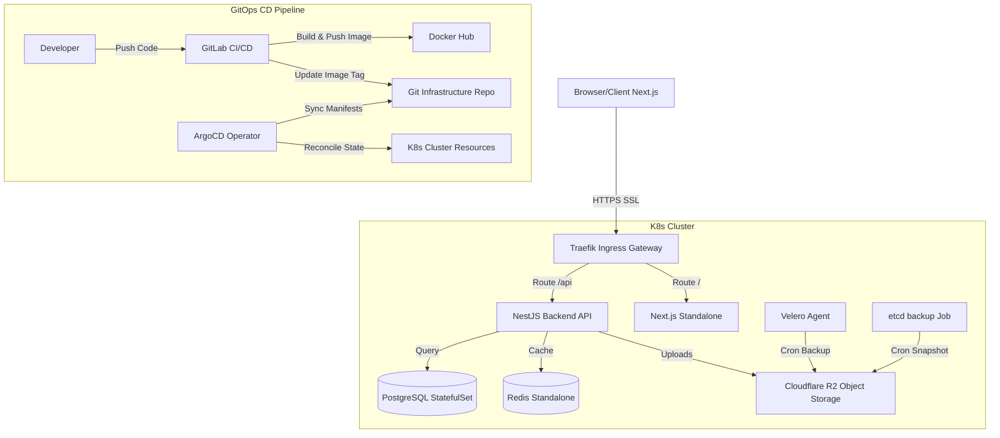

# 🚀 System Engineer Portfolio & Blog Portal

Chào mừng bạn đến với kho lưu trữ mã nguồn của hệ thống **Portfolio & Blog Cá nhân** của **LƯU ĐÌNH MÁC**. Đây là một dự án chuẩn doanh nghiệp (Production-Grade) được thiết kế chuyên biệt cho Kỹ sư Hệ thống (System Engineer) để chia sẻ kiến thức công nghệ và trình diễn năng lực hạ tầng.

Hệ thống tuân thủ triết lý **Documentation-as-Code (DaC)**, tích hợp toàn bộ tài liệu kỹ thuật trực tiếp vào nhánh mã nguồn để đồng bộ phiên bản và quản trị dễ dàng.

---

## 🏛️ Sơ Đồ Kiến Trúc Hệ Thống (System Architecture)

Dự án áp dụng mô hình **Smart Server / Lean Client**, kết hợp hạ tầng điều phối Container tự động hóa qua Kubernetes (K8s) và quy trình GitOps hiện đại.



---

## 📖 Cổng Thư Mục Tài Liệu (Documentation Directory Portal)

Hệ thống tài liệu kỹ thuật được phân loại theo cấu trúc phân cấp khoa học tại thư mục `docs/`. Hãy nhấp vào các liên kết dưới đây để truy cập chi tiết:

### 1. 🌟 Tổng Quan & Định Hướng (Overview & Guidelines)
*   **[Project Mission & Governance](docs/overview/project_mission.md)**: Sứ mệnh dự án, ma trận phân chia quyền sở hữu mã nguồn (Ownership Matrix) và chính sách quản lý tài liệu.
*   **[Coding Guidelines](docs/overview/coding_guidelines.md)**: Quy tắc lập trình "Smart Server, Lean Client", kiến trúc thư mục Frontend/Backend và tiêu chuẩn kiểm thử.

### 2. 🏗️ Kiến Trúc Hệ Thống (Architecture & Design)
*   **[System Architecture Design](docs/architecture/system_architecture.md)**: Chi tiết thiết kế mạng (Networking), cấu trúc phân chia Namespace K8s, chính sách lưu trữ (StorageClass Longhorn/R2) và cơ chế co giãn HPA.
*   **[Architecture Decision Records (ADR)](docs/adr/0001-clean-architecture-refactor.md)**: Nhật ký quyết định kiến trúc (ADR) ghi lại quá trình tái cấu trúc Clean Architecture cho database schema và Prisma Client.

### 3. 🚀 Khởi Đầu & Tuyển Dụng (Onboarding & Hiring)
*   **[Local Development Setup Guide](docs/onboarding/local_development.md)**: Hướng dẫn cài đặt môi trường dev cục bộ, cấu hình SSH Tunnel bảo mật, và quy chuẩn quản trị biến môi trường.
*   **[Curriculum Vitae (Bilingual CV)](docs/onboarding/)**: Hồ sơ năng lực của tác giả viết bằng **[Tiếng Anh (cv_english.md)](docs/onboarding/cv/cv_english.md)** và **[Tiếng Việt (cv_vietnamese.md)](docs/onboarding/cv/cv_vietnamese.md)**.

### 4. ☸️ Quy Trình Triển Khai & GitOps (Deployment & GitOps)
*   **[Deployment Standards & Policies](docs/deployment/deployment_standards.md)**: Tiêu chuẩn đặt tên tài nguyên, quy định đóng gói Docker đa tầng (Multi-stage), chính sách chạy Container không dùng root (Non-root user).
*   **[CI/CD & GitOps Workflow](docs/deployment/ci_cd_gitops.md)**: Sơ đồ chi tiết pipeline GitLab CI/CD, cơ chế tự động mutation tag qua `yq`, đồng bộ tự động ArgoCD và smoke test.
*   **[Bare-Metal Kubernetes Setup](docs/deployment/k8s_setup_guide.md)**: Cẩm nang cài đặt cụm K8s từ đầu qua Ansible, thiết lập Ingress Traefik HostNetwork, và cơ chế mã hóa Secret bằng Sealed Secrets.

### 5. 🚨 Runbook Vận Hành (Operational Runbooks)
*   **[Backup & Restore Playbook](docs/runbooks/backup_restore.md)**: Quy trình sao lưu tự động Velero, chụp snapshot cơ sở dữ liệu etcd hằng ngày, và khôi phục dữ liệu PostgreSQL qua pg_dump.
*   **[Disaster Recovery Procedures](docs/runbooks/disaster_recovery.md)**: Hướng dẫn xử lý sự cố khẩn cấp (kẹt Prisma Migration lock, IP whitelist Traefik 403 Forbidden, rebuild VPS vật lý, và khôi phục sâu etcd).

### 6. 🛠️ Gỡ Lỗi & Sự Cố (Troubleshooting & Incident Reports)
*   **[Application Debug Journal](docs/troubleshooting/debug_journal.md)**: Nhật ký xử lý các lỗi ứng dụng (mất phiên đăng nhập, runtime react hooks, Next.js hydration failed).
*   **[Kubernetes Incident Logs](docs/troubleshooting/k8s_incidents.md)**: Phân tích nguyên nhân gốc rễ (RCA) các sự cố hạ tầng K8s thực tế (CPU spike do Velero Kopia, đóng băng standalone proxy, lỗi ký tự BOM SQL).

### 7. ⚖️ Pháp Lý & Bảo Mật (Legal & Privacy)
*   **[Privacy Policy](docs/legal/privacy_policy.md)**: Cam kết bảo mật thông tin, chính sách lưu trữ cookies, thu thập logs và tuân thủ các quy định an ninh mạng (GDPR / Nghị định 13 Việt Nam).

---

## ⚡ Khởi Chạy Nhanh Dự Án Cục Bộ (Quick Start)

### 1. Yêu cầu hệ thống (Prerequisites)
*   Node.js LTS (phiên bản `20.x` trở lên).
*   pnpm (phiên bản `9.x` trở lên).
*   PostgreSQL chạy local hoặc qua Docker container.

### 2. Cài đặt & Khởi động
```bash
# Clone repository
git clone https://github.com/luudinhmac/myweb-profile-blog.git
cd myweb-profile-blog

# Cài đặt toàn bộ dependencies ở thư mục gốc
pnpm install

# Setup biến môi trường cho Backend & Frontend (Xem hướng dẫn chi tiết tại docs/onboarding/local_development.md)
cp backend/.env.example backend/.env
cp frontend/.env.example frontend/.env

# Khởi chạy chế độ phát triển đồng thời (Concurrent Dev Mode)
pnpm dev
```
Giao diện Web UI sẽ khả dụng tại: `http://localhost:3000`  
API Swagger Tài liệu Backend khả dụng tại: `http://localhost:3001/api/docs`

---
*Dự án được duy trì bởi **Lưu Đình Mác** (luumac2801@gmail.com).*
