# 🚀 Production-Grade GitOps Platform with CI/CD, Security & Observability

[](https://luumac.io.vn)
[](#)
[](https://kubernetes.io)
[](https://argoproj.github.io/cd/)
[](https://docs.gitlab.com/ee/ci/)
[](https://helm.sh)
[](https://www.docker.com)
[](https://www.terraform.io)
[](https://prometheus.io)
[](https://grafana.com)
[](https://traefik.io)
[](https://www.cloudflare.com)
[](https://velero.io)

Repository này trình bày một nền tảng Kubernetes hoàn chỉnh, sẵn sàng cho môi trường production, được xây dựng dựa trên GitOps, quét bảo mật tự động và khả năng tự phục hồi (self-healing). Đây vừa là một trang blog thực tế, vừa là bản trình diễn toàn diện về kỹ thuật hạ tầng hiện đại, chứng minh các phương pháp vận hành DevOps tốt nhất trong một môi trường thực tế có tính sẵn sàng cao.

## 💎 Điểm Nổi Bật & Tính Năng Cốt Lõi (Key Features & Highlights)

*   **✅ Zero-Downtime Deployments**: Cập nhật dạng Rolling update với `maxUnavailable: 0` kết hợp đầu dò startup/readiness tự động để đảm bảo không định tuyến lưu lượng đến các container chưa sẵn sàng.
*   **🛡️ Security-First**: Các container chạy dưới quyền non-root, truy cập bảo mật qua Cloudflare Zero Trust, quét lỗ hổng bảo mật tự động (Trivy) và quản lý Sealed Secrets.
*   **📊 Self-Healing & Observability**: Tự phục hồi qua các đầu dò liveness/readiness, tự động co giãn tài nguyên HPA và gửi cảnh báo thời gian thực qua Prometheus/Grafana.
*   **⚡ Disaster Recovery**: Lịch trình sao lưu tự động hàng ngày cho dữ liệu ứng dụng (Velero) và trạng thái cụm (etcd) đẩy lên Cloudflare R2.
*   **🔔 Smart Notifications**: Cảnh báo thông minh gửi tới MS Teams/Telegram phân loại theo trạng thái pipeline (chỉ chạy cho các bước quan trọng trên staging/prod).

---

## 📂 Kiến Trúc Đa Kho Lưu Trữ (Multi-Repository Architecture)

Mặc dù thư mục này hiển thị toàn bộ các thành phần để thuận tiện cho việc tham khảo ngoại tuyến và quản trị tập trung, trên thực tế, dự án được triển khai và vận hành độc lập thông qua **3 kho lưu trữ (repositories) riêng biệt** trên GitLab để đảm bảo tính an toàn, bảo mật thông tin và phân tách trách nhiệm (Separation of Concerns):

1.  **Frontend Repository ([`frontend/`](frontend))**:
    *   Chứa mã nguồn ứng dụng giao diện người dùng Next.js (App Router, Standalone Mode).
    *   Sở hữu pipeline CI/CD riêng để build/test/scan Docker image của frontend.
2.  **Backend Repository ([`backend/`](backend))**:
    *   Chứa mã nguồn NestJS API, cấu hình ORM Prisma và mã nguồn migrations.
    *   Sở hữu pipeline CI/CD riêng để build/test/scan Docker image của backend.
3.  **Infrastructure Repository ([`infra/`](infra))**:
    *   Chứa toàn bộ mã nguồn cấu hình hạ tầng GitOps (Kubernetes manifests, Helm values.yaml cho Staging và Production), Ansible Playbook cấu hình hệ điều hành máy chủ và các cấu hình Cloudflare Tunnel.
    *   Đây là kho lưu trữ trung tâm mà ArgoCD lắng nghe để đồng bộ hóa trạng thái ứng dụng lên cụm Kubernetes.

---

## 🏛️ Sơ Đồ Kiến Trúc Hệ Thống (System Architecture)

Dự án được xây dựng dựa trên mô hình **Smart Server / Lean Client**, kết hợp môi trường container tự động hóa được quản lý thông qua Kubernetes và điều phối bằng GitOps.

### 1. Quy trình tích hợp & triển khai liên tục (GitOps CD Pipeline)
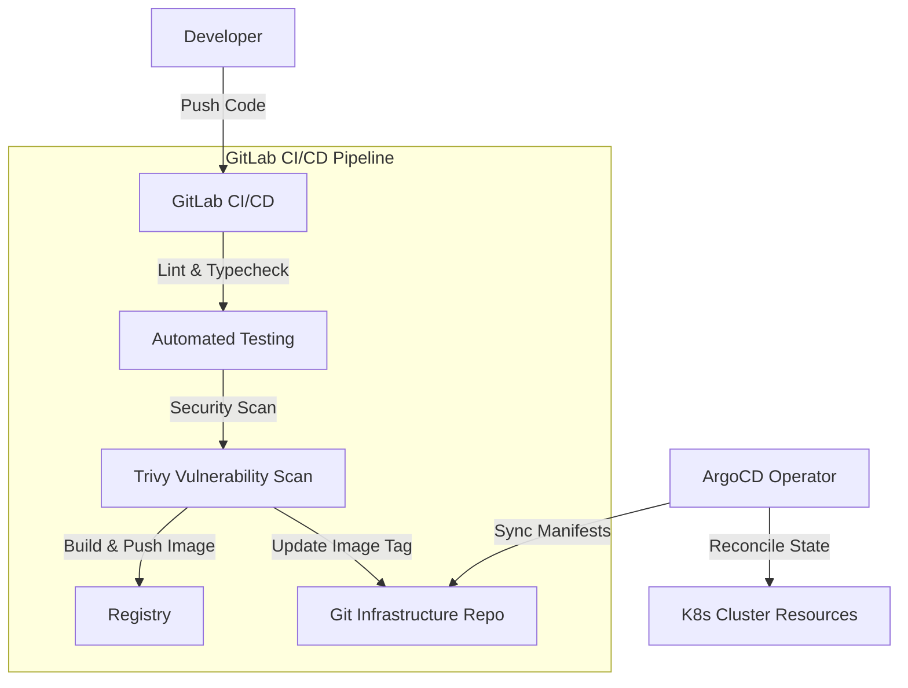

### 2. Kiến trúc phân bổ tài nguyên và định tuyến cụm (K8s Cluster Runtime)
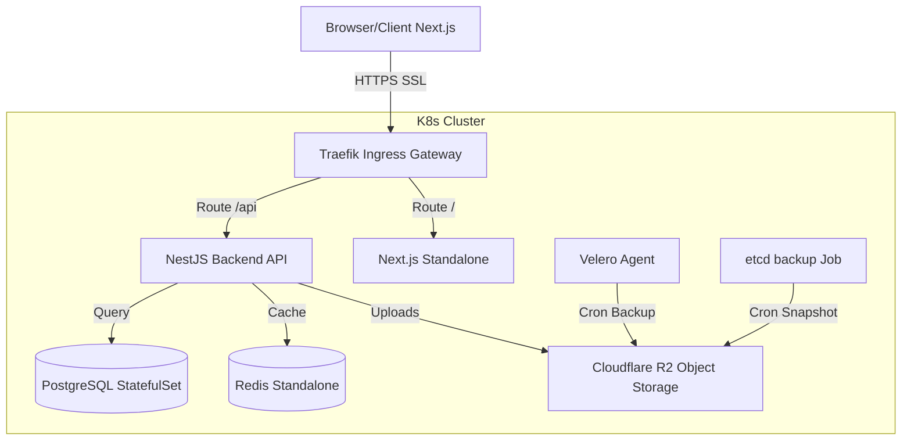

---

## 🛡️ Cấu Hình Pod Production Thực Tế (Production Pod Example)

Dưới đây là một ví dụ thực tế cấu hình Pod đang chạy trên môi trường production, thể hiện cơ chế quản lý QoS, cấu hình các đầu dò sức khỏe (probes) hoạt động và kiểm soát bảo mật:

```text
Name:             portfolio-backend-7bc4dcfb95-xyz45
Namespace:        production
Priority:         0
Service Account:  portfolio-backend-sa
Node:             k8s-node-2/192.168.1.12
Start Time:       Sat, 27 Jun 2026 10:00:00 +0700
Labels:           app.kubernetes.io/instance=portfolio-backend
                  app.kubernetes.io/name=portfolio-backend
                  pod-template-hash=7bc4dcfb95
Annotations:      checksum/config: 86b72a6b...
Status:           Running
IP:               10.244.1.45
Controlled By:    ReplicaSet/portfolio-backend-7bc4dcfb95
Containers:
  portfolio-backend:
    Container ID:   containerd://e85ba92b...
    Image:          portfolio-macld/portfolio-backend:f902622
    Image ID:       docker.io/portfolio-macld/portfolio-backend@sha256:d82b...
    Port:           3001/TCP
    State:          Running
      Started:      Sat, 27 Jun 2026 10:00:05 +0700
    Ready:          True
    Restart Count:  0
    Limits:
      cpu:     500m
      memory:  512Mi
    Requests:
      cpu:     100m
      memory:  256Mi
    Liveness:  http-get http://:3001/api/v1/health delay=15s timeout=1s period=10s #success=1 #failure=3
    Readiness: http-get http://:3001/api/v1/health delay=15s timeout=1s period=5s #success=1 #failure=3
    Environment Variables from:
      portfolio-backend-configmap  ConfigMap  Optional: false
      portfolio-backend-secrets    Secret     Optional: false
QoS Class:                   Burstable
```

### Phân Tích Pod Production
*   **`Restart Count: 0`**: Chứng minh sự ổn định thời gian chạy của ứng dụng. Không có hiện tượng rò rỉ bộ nhớ (memory leaks) hay các ngoại lệ nghiêm trọng chưa được xử lý dẫn đến việc container engine trên node phải khởi động lại pod.
*   **`QoS Class: Burstable`**: Pod định cấu hình mức requests vừa phải (`100m` CPU, `256Mi` Memory) và giới hạn limits rộng rãi (`500m` CPU, `512Mi` Memory). Điều này cho phép Kubernetes scheduler lập lịch phân bổ pod tối ưu, trong khi vẫn cho phép bùng nổ tài nguyên (resource bursts) khi lưu lượng truy cập tăng đột biến.
*   **`Image Tag: f902622`**: Thay vì sử dụng thẻ mutable `latest` dễ thay đổi, deployment khóa cứng theo mã Git Short-SHA để đảm bảo quá trình build mang tính nhất quán và có khả năng tái lặp.
*   **`Liveness & Readiness Probes`**: Kiểm tra liveness liên tục theo dõi để phát hiện các lỗi deadlock hoặc trạng thái không phản hồi nhằm kích hoạt tự phục hồi (self-healing), trong khi đầu dò readiness đảm bảo lưu lượng truy cập chỉ được định tuyến đến pod khi các tài nguyên phụ thuộc (như database và cache) đã kết nối thành công.


## 🔄 Quy Trình CI/CD & Smoke Test (CI/CD & Smoke Test Workflow)

Pipeline CI/CD thực thi các bước kiểm tra chất lượng và bảo mật nghiêm ngặt trước khi triển khai:

1.  **Code Validation**: Thực hiện kiểm tra ESLint, định dạng code và kiểm tra dependencies.
2.  **Security Scan**: Chạy quét bảo mật Trivy trực tiếp trên mã nguồn và các Docker images.
3.  **Docker Build & Push**: Đóng gói Docker image dạng multi-stage và đẩy lên Docker Hub.
4.  **GitOps Manifest Update**: Thay đổi tham số override trong kho lưu trữ hạ tầng GitOps.
5.  **ArgoCD Sync**: Tự động đồng bộ và triển khai image mới lên Kubernetes.
6.  **Smoke Testing**: Tự động chạy các bài kiểm thử khói (smoke tests) sau khi triển khai:
    *   **Public Read Query Tests**: Xác thực các endpoints API (sắp xếp, lọc dữ liệu, phân trang) trên cả hai môi trường.
    *   **Write Flow & Autoclean (Staging)**: Kiểm thử an toàn luồng API đăng ký/đăng nhập/ghi dữ liệu, sau đó đăng nhập bằng quyền Super Admin để tự động dọn dẹp các user test vừa tạo.
    *   **Network Timeouts**: Rào chắn lỗi treo luồng bằng cách áp dụng kết nối/phản hồi timeout cho lệnh curl.

---

## 📸 Hình Ảnh Minh Họa Hệ Thống (System & Operations Gallery)

### 1. Quản lý trạng thái ứng dụng bằng ArgoCD (ArgoCD GitOps Dashboard)
Giao diện ArgoCD hiển thị trạng thái đồng bộ hóa tự động và cấu trúc tài nguyên phân bổ cho các pod backend trong cụm Kubernetes.
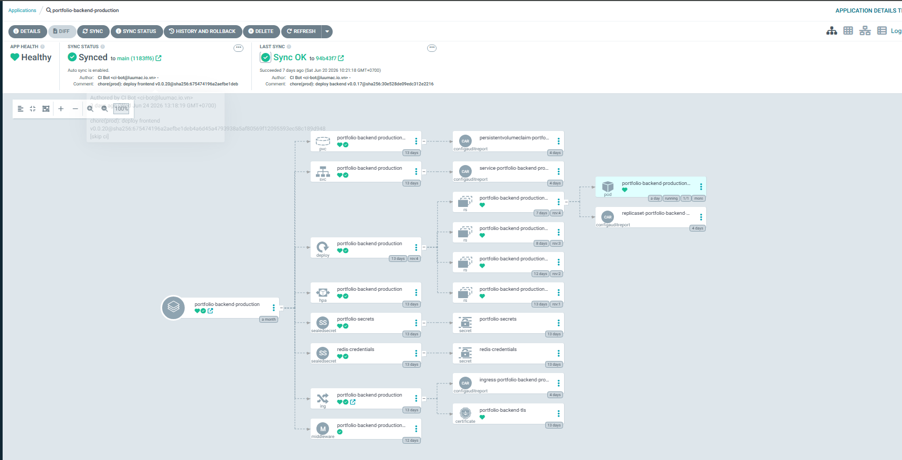

### 2. Giám sát tài nguyên hệ thống qua Grafana (Observability & Metrics Dashboard)
Các số liệu về tải CPU, dung lượng Memory và trạng thái các Node trong cụm được biểu diễn trực quan thời gian thực qua Grafana dashboards.
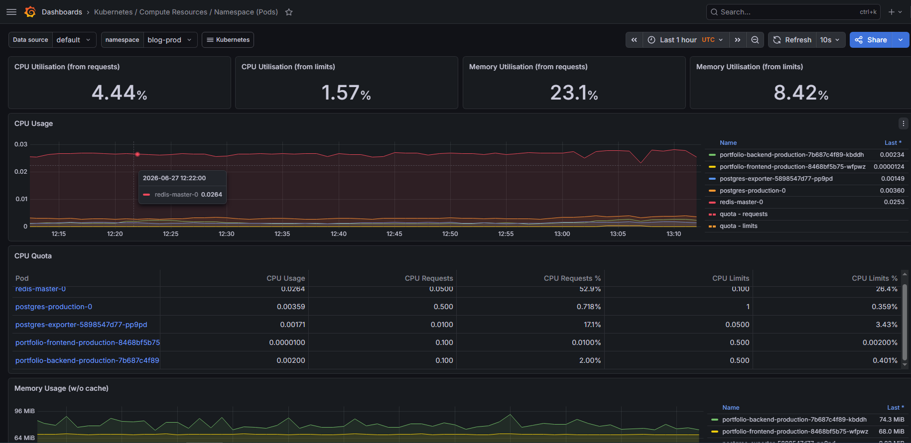
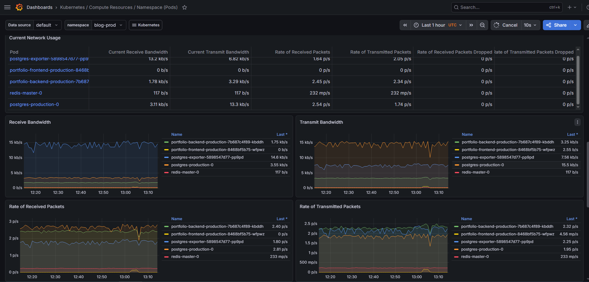
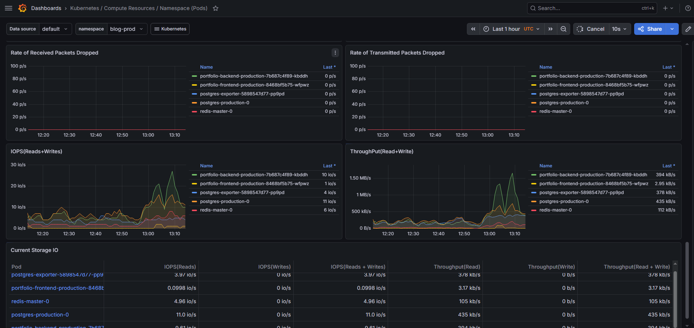

### 3. Bảo vệ an toàn cổng Admin qua Cloudflare Zero Trust
Yêu cầu mã xác thực dùng một lần (OTP) gửi qua email trước khi quản trị viên có thể kết nối vào các dịch vụ nội bộ (như Kubernetes Dashboard, Grafana, ArgoCD).
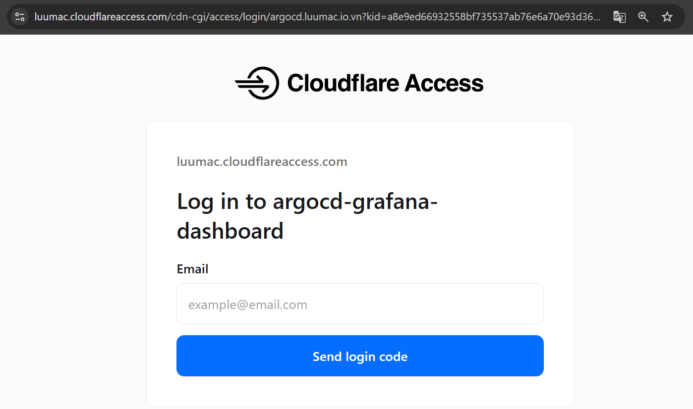
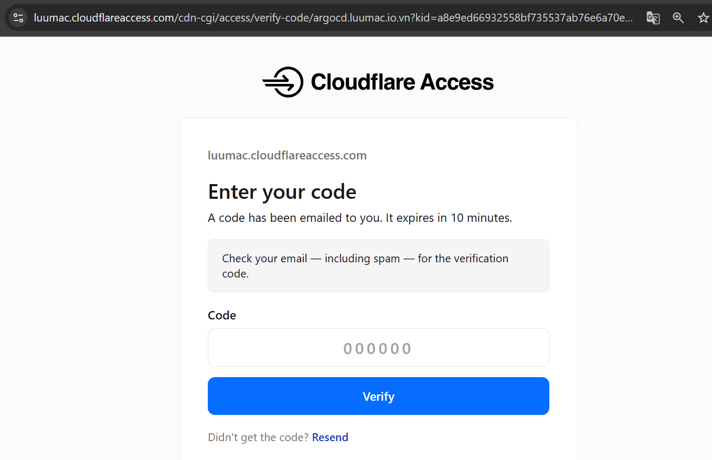

### 4. Hệ thống sao lưu tự động (Velero & etcd Daily Backup)
Kiểm tra lịch trình chạy cronjob sao lưu cơ sở dữ liệu và trạng thái cụm định kỳ hàng ngày, dữ liệu nén được truyền tải và lưu trữ an toàn trên Cloudflare R2.
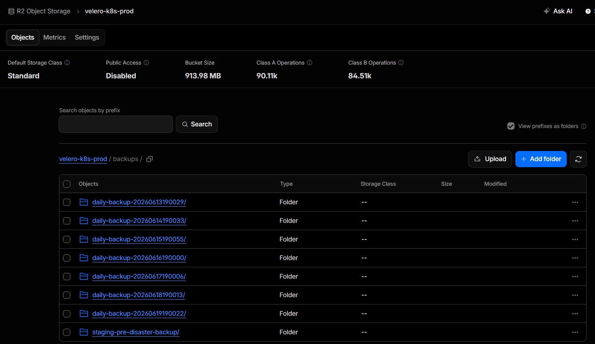
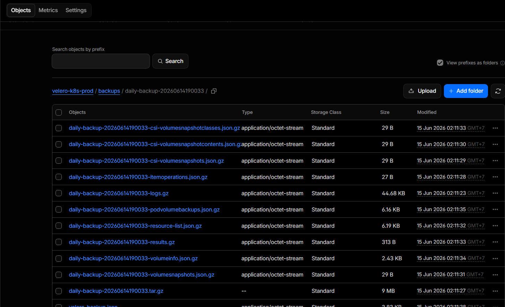

### 5. Thông báo tức thời qua MS Teams (CI/CD Pipeline Alerts)
Thông báo tự động gửi về kênh chat MS Teams của đội ngũ vận hành khi có thay đổi trạng thái hoặc lỗi phát sinh trong quá trình build/deploy.
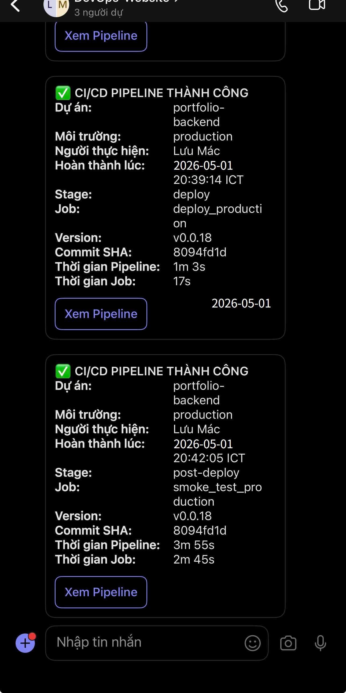

### 6. Giao diện quản trị Kubernetes Dashboard (K8s Administration Portal)
Giao diện điều khiển tập trung hiển thị danh sách các pod đang chạy và tình trạng cấp phát tài nguyên cho các cấu phần ứng dụng trong cụm.
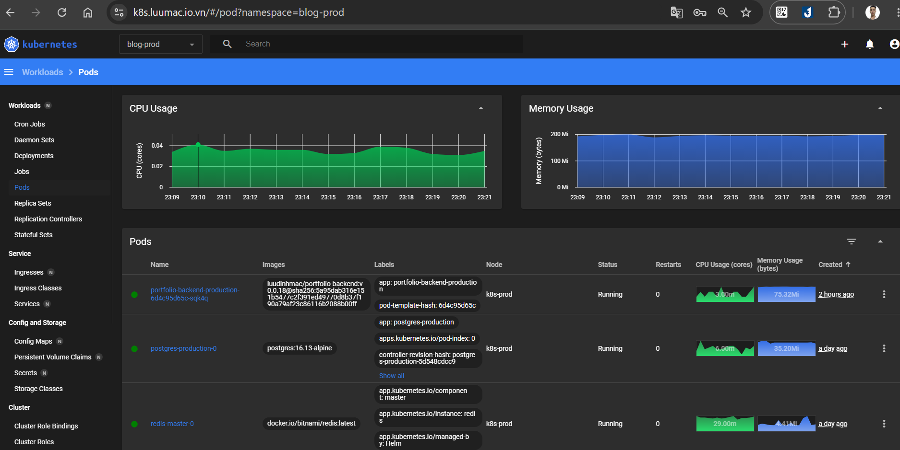

---

## 📚 Liên Kết Tài Liệu Chi Tiết (Links to Deep Dives)

Để tìm hiểu chi tiết về các quyết định thiết kế, cẩm nang phục hồi hệ thống và hướng dẫn cài đặt, hãy truy cập [Documentation Portal](docs/README.md) của chúng tôi:

*   **[System Architecture](docs/architecture/system-architecture.md)**: Sơ đồ kiến trúc mạng, phân chia namespace, và cơ chế co giãn HPA.
*   **[Architecture Decision Records (ADR)](docs/architecture/adr/README.md)**: Nhật ký quyết định kiến trúc của dự án.
*   **[GitOps & CI/CD Workflow](docs/deployment/gitops-workflow.md)**: Quy trình CI/CD từ code push đến đồng bộ ArgoCD.
*   **[Zero-Downtime Strategy](docs/deployment/zero-downtime-strategy.md)**: Thiết lập RollingUpdate, Liveness/Readiness probes và HPA.
*   **[Disaster Recovery & Backups](docs/operations/disaster-recovery.md)**: Cấu hình Velero, snapshot etcd và quy trình khôi phục.
*   **[Cloudflare Zero Trust Access](docs/security/cloudflare-zero-trust.md)**: Bảo vệ hệ thống thông qua Cloudflare Access và OTP.
*   **[Smoke Test Strategy](docs/testing/smoke-test-strategy.md)**: Nội dung script smoke test và phân tích các bước kiểm thử.
*   **[Local Development Onboarding](docs/onboarding/local-development.md)**: Hướng dẫn cài đặt môi trường chạy local, SSH Config, và cấu hình `.env`.

---
*Dự án được duy trì bởi **Lưu Đình Mác** (luumac2801@gmail.com).*
