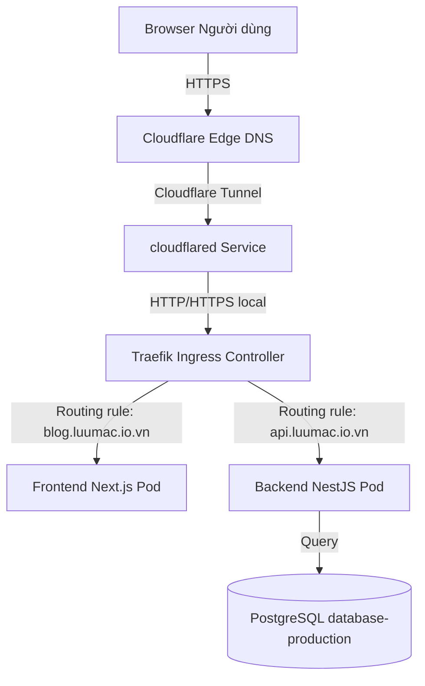
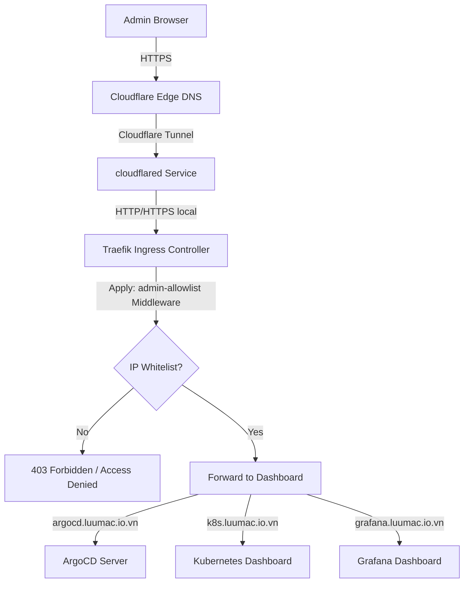
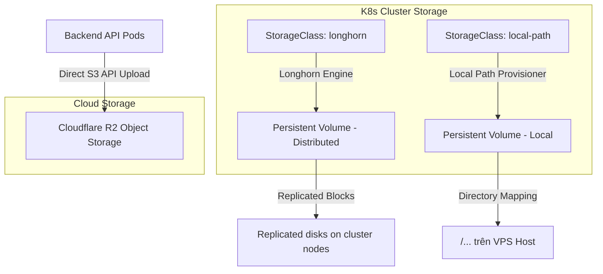

# 🏛️ System Architecture

Tài liệu này mô tả kiến trúc tổng quan hệ thống Portfolio & Blog, từ cách phân chia tài nguyên, luồng dữ liệu của người dùng, luồng truy cập của quản trị viên đến cách phân bổ lưu trữ trên cụm Kubernetes.

---

## 🗺️ Luồng Dữ Liệu & Định Tuyến (Traffic Flow)

Hệ thống sử dụng **Cloudflare Tunnel** làm cổng vào chính (Ingress Tunnel), loại bỏ việc mở cổng trực tiếp từ Router/Firewall của máy chủ ra Internet (ngoại trừ cổng SSH `2222`).

### 1. Luồng truy cập của Người dùng (Public Traffic)
Người dùng truy cập vào Blog hoặc API sẽ đi qua Cloudflare Edge Network, qua Tunnel và đến Traefik Ingress Controller trước khi vào Pod:

### 2. Luồng truy cập của Quản trị viên (Admin Traffic)
Các trang quản trị (ArgoCD, K8s Dashboard, Grafana) được bảo vệ bởi middleware `admin-allowlist` (chỉ chấp nhận các IP được khai báo trước):

---

## 🗂️ Phân Bổ Namespace trên Kubernetes (Cluster Layout)

Cụm Kubernetes được tổ chức thành các Namespace chuyên biệt nhằm cô lập tài nguyên:

| Namespace | Vai trò | Các tài nguyên chính |
| :--- | :--- | :--- |
| **`infra`** | Hạ tầng mạng, định tuyến | Traefik Ingress, `admin-allowlist` Middleware |
| **`cert-manager`** | Quản lý chứng chỉ SSL/TLS | Cert-manager controller & resource definitions |
| **`blog-prod`** | Môi trường Production | Backend NestJS, Frontend Next.js, StatefulSet PostgreSQL, Redis |
| **`blog-staging`** | Môi trường Staging | Backend-staging, Frontend-staging, StatefulSet PostgreSQL Staging, Redis Staging |
| **`monitoring`** | Giám sát & Đo đạc | Prometheus, Grafana, Metrics-Server |
| **`kubernetes-dashboard`**| Giao diện quản trị K8s | Kubernetes Dashboard, `admin-user` ServiceAccount |
| **`argocd`** | Triển khai GitOps | ArgoCD Server, Application Controllers |
| **`local-path-storage`**| Trình cấp phát lưu trữ local | Local Path Provisioner |
| **`longhorn-system`** | Lưu trữ phân tán | Longhorn storage components |
| **`velero`** | Sao lưu & Phục hồi | Velero backup manager & cron jobs |
| **`trivy-system`** | Quét lỗ hổng bảo mật | Trivy Operator & reports |

## 💾 Kiến Trúc Lưu Trữ (Storage Architecture)

Hệ thống kết hợp giữa lưu trữ khối cục bộ/phân tán trên cụm Kubernetes cho cơ sở dữ liệu và lưu trữ đối tượng Cloudflare R2 cho tài nguyên tĩnh:

### Chi tiết phân bổ lưu trữ:
* **Cloudflare R2 Object Storage (Bucket `blog-upload-prod`):**
  * **avatar/**: Lưu trữ toàn bộ ảnh đại diện của người dùng.
  * **post/**: Lưu trữ toàn bộ ảnh bìa bài viết, hình ảnh chèn trong nội dung blog và các file tài liệu đính kèm.
* **StorageClass `longhorn`:** Sử dụng giải pháp lưu trữ khối phân tán Longhorn làm hạ tầng lưu trữ chính cho Production (PostgreSQL Database và Redis persistence).
* **StorageClass `local-path`:** Tự động cấp phát hostPath trên Node VPS cho các nhu cầu dữ liệu của môi trường Staging.
* **Đường dẫn lưu trữ vật lý trên VPS Host:**
  * Database Production: `<host_storage_path>/postgres-production-pvc`
  * Database Staging: `<host_storage_path>/postgres-staging-pvc`

---

## ⚙️ Cơ Chế Tự Động Co Giãn (Autoscaling - HPA)

Trên môi trường **Production**, cả Frontend và Backend đều được liên kết với một Horizontal Pod Autoscaler (HPA) theo dõi mức sử dụng tài nguyên:
* **Tải bình thường:** Hệ thống duy trì tối thiểu **2 Pods** trên mỗi dịch vụ để đảm bảo khả năng High Availability (HA) và Zero-Downtime khi cập nhật.
* **Tải cao:** Nếu mức sử dụng CPU trung bình vượt ngưỡng **80%**, HPA sẽ tự động kích hoạt tạo thêm Pods lên tối đa **5 Pods** (yêu cầu Metrics Server hoạt động lành mạnh).
