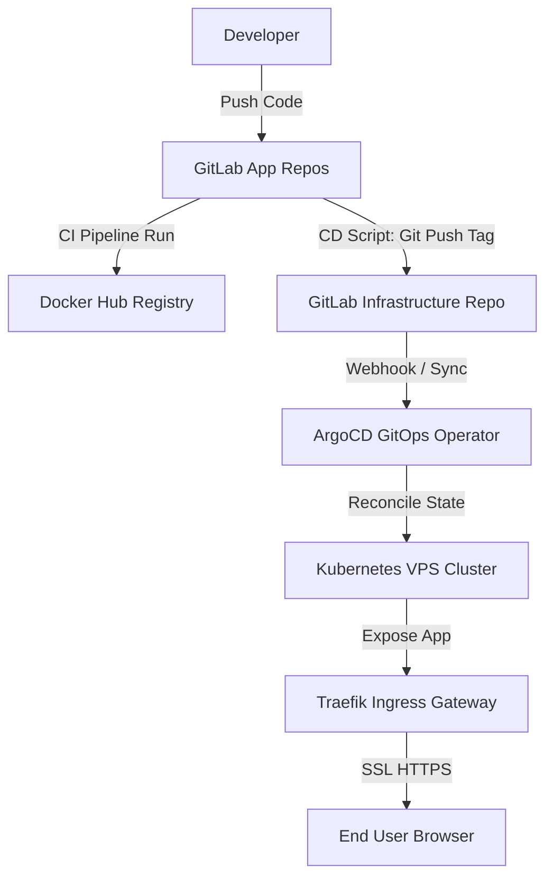

# ☸️ HƯỚNG DẪN TRIỂN KHAI & VẬN HÀNH PRODUCTION KUBERNETES

## 1. TỔNG QUAN KIẾN TRÚC & HẠ TẦNG (ARCHITECTURE OVERVIEW)

Hệ thống được thiết kế theo kiến trúc chuẩn **Cloud-Native GitOps**, tự động hóa toàn diện từ quy trình mã nguồn (Codebase), Quy trình tích hợp & bàn giao liên tục (CI/CD) cho đến quá trình đồng bộ hóa hạ tầng (Orchestration) trên cụm **Kubernetes (K8s) Production**.

### 1.1. Sơ đồ luồng vận hành GitOps (GitOps Operational Flow)


### 1.2. Sơ đồ phân chia Namespace trên cụm K8s
Hệ thống được phân vùng độc lập (Namespace Isolation) để đảm bảo an toàn tài nguyên và bảo mật:
*   **`blog-prod`**: Môi trường chạy thực tế của người dùng công cộng (Frontend Production, Backend Production, PostgreSQL Prod, Redis Prod).
*   **`blog-staging`**: Môi trường Staging phục vụ việc kiểm thử các tính năng mới trước khi lên sóng (Frontend Staging, Backend Staging, PostgreSQL Staging, Redis Staging).
*   **`argocd`**: Hệ thống quản lý đồng bộ GitOps tự động.
*   **`monitoring`**: Hệ thống giám sát tài nguyên (Prometheus, Grafana, Metrics-Server).

---

## 2. QUY TRÌNH DỰNG CẤU HÌNH & TRIỂN KHAI CHI TIẾT (STEP-BY-STEP SETUP)

Để khởi dựng toàn bộ hệ thống từ đầu trên một cụm máy chủ mới, hãy thực hiện theo đúng các bước sau:

### Bước 2.1. Nạp Khóa Bảo Mật Thủ Công (Kubernetes Secrets)
Các biến môi trường nhạy cảm không được phép lưu trữ trên Git. Bạn bắt buộc phải nạp thủ công vào K8s trước khi triển khai ứng dụng:

#### A. Đối với môi trường Production (Namespace: `blog-prod`)
```bash
kubectl create secret generic portfolio-secrets -n blog-prod \
  --from-literal=DATABASE_URL="postgresql://<db_user>:<db_password>@postgres.blog-prod:5432/<db_name>" \
  --from-literal=JWT_SECRET="<jwt_secret_key>"
```

#### B. Đối với môi trường Staging (Namespace: `blog-staging`)
```bash
kubectl create secret generic portfolio-secrets -n blog-staging \
  --from-literal=DATABASE_URL="postgresql://<db_user>:<db_password>@postgres.blog-staging:5432/<db_name>" \
  --from-literal=JWT_SECRET="<jwt_secret_key>"
```

---

### Bước 2.2. Khai báo Biến liên kết CI/CD trên GitLab (GITLAB_API_TOKEN)
Để quy trình tự động cập nhật Tag giữa repo App và repo Infra diễn ra trơn tru:
1.  Truy cập vào repo **`<infra_repository>`** -> **Settings > Access Tokens**.
2.  Tạo một Token mới:
    *   **Name:** `CI/CD Deploy Token`
    *   **Role:** `Developer`
    *   **Scopes:** Tích chọn `write_repository` và `read_repository`.
3.  Sao chép chuỗi token tạo ra.
4.  Mở cài đặt của cả hai repo **`<frontend_repository>`** và **`<backend_repository>`** -> **Settings > CI/CD > Variables** -> Tạo biến:
    *   **Key:** `GITLAB_API_TOKEN`
    *   **Value:** *Chuỗi token vừa tạo*
    *   **Flags:** **BỎ TÍCH** chọn `Protect variable` (để hỗ trợ chạy trên mọi nhánh/tag) và tích chọn `Mask variable` để bảo mật.

---

### Bước 2.3. Quy trình Đóng gói & Tự động Deploy lên Production
1.  Gộp code từ nhánh **`dev`** vào nhánh **`main`** ở repo ứng dụng (Frontend hoặc Backend).
2.  Đánh tag phiên bản mới trên nhánh `main` (Ví dụ: `v1.0.9`, `v1.0.10`).
3.  GitLab CI sẽ tự động kích hoạt:
    *   Job **`build_production`**: Build Docker Image Standalone, nén cứng các cấu hình tĩnh và đẩy lên Docker Hub.
    *   Job **`deploy_production`** (Chạy thủ công bằng nút bấm): Tự động clone repo `infra`, cập nhật tag phiên bản mới vào file cấu hình tương ứng (`backend-values.yaml` hoặc `frontend-values.yaml`) và push ngược trở lại Git.
4.  ArgoCD lập tức phát hiện thay đổi trên Repo Infra và đồng bộ tự động kéo Pod mới chạy trên VPS.

---

## 3. BẢNG TRA CỨU NHANH LỆNH VẬN HÀNH (OPERATIONS CHEATSHEET)

### Lệnh Kiểm Tra Sức Khỏe Hệ Thống (Health Check)
```bash
# Kiểm tra trạng thái toàn bộ Pods trên cụm
kubectl get pods -A

# Xem log thời gian thực của Backend Production
kubectl logs -f deployment/backend -n blog-prod -c backend

# Xem log tiến trình chạy Migration của Backend Staging
kubectl logs deployment/backend-staging -n blog-staging -c prisma-migrate
```

### Lệnh Sao Lưu & Phục Hồi Database (Backup & Restore)
```bash
# Sao lưu Database Production ra file SQL
kubectl exec -t postgres-0 -n blog-prod -- pg_dump -U <db_user> -d <db_name> > production_backup.sql

# Khôi phục Database từ file SQL
cat production_backup.sql | kubectl exec -i postgres-0 -n blog-prod -- psql -U <db_user> -d <db_name>
```

---

## 4. KẾT QUẢ ĐẠT ĐƯỢC (FINAL STATUS REPORT)
*   **Production Frontend & Backend:**  ĐANG HOẠT ĐỘNG HOÀN HẢO (Chuẩn HTTPS SSL tự động, bảo mật cao).
*   **Staging Frontend & Backend:** ĐANG HOẠT ĐỘNG ỔN ĐỊNH (Phục vụ việc phát triển tính năng mới).
*   **GitOps Workflow:**  TỰ ĐỘNG HÓA 100% (Đồng bộ trực tiếp qua GitLab CI/CD và ArgoCD).
