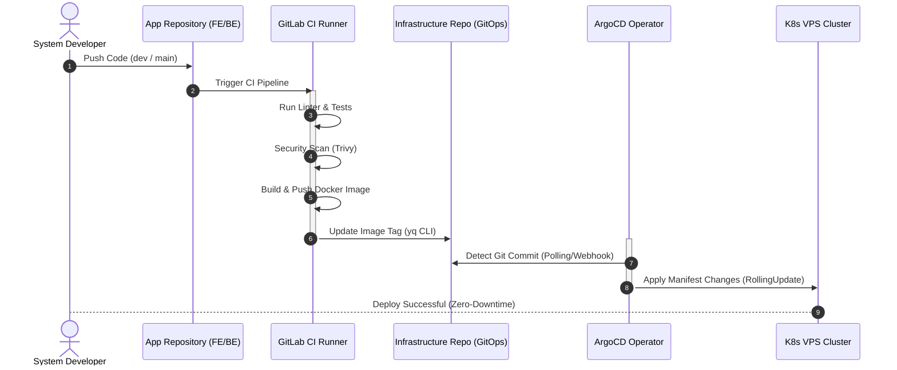
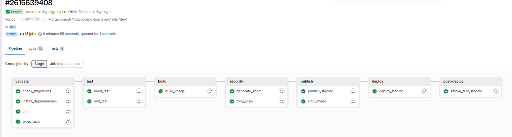
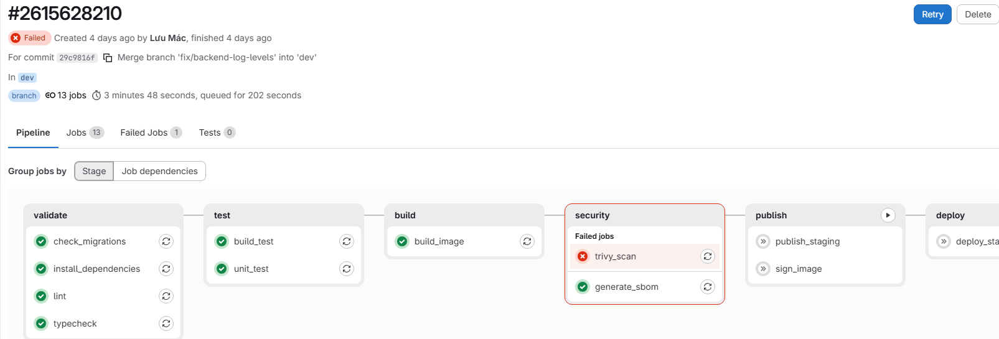
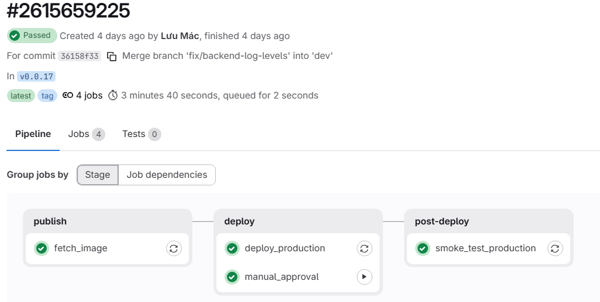

# 🚢 CI/CD Pipeline & GitOps Flow

Tài liệu này mô tả chi tiết quy trình tích hợp liên tục và triển khai liên tục (CI/CD) dựa trên triết lý **GitOps** sử dụng **GitLab CI** và **ArgoCD**.

---

## 🏗️ Kiến Trúc Kho Lưu Trữ (Repository Structure)

Dự án được phân rã thành 3 kho lưu trữ độc lập để đảm bảo an toàn bảo mật thông tin và phân tách trách nhiệm vận hành:

1. **`portfolio-frontend`**: Chứa toàn bộ mã nguồn giao diện Next.js (App Router).
2. **`portfolio-backend`**: Chứa toàn bộ mã nguồn API NestJS (Prisma).
3. **`portfolio-infrastructure`**: Chứa các Ansible Playbooks setup máy chủ, cấu hình Helm Charts và các file định nghĩa biến (values.yaml) cho Staging/Production.

---

## 🔄 Sơ Đồ Quy Trình Triển Khai (Deployment Flow)

Quy trình tự động hóa từ khi nhà phát triển đẩy mã nguồn mới lên Git cho đến khi container phiên bản mới chạy ổn định trên cụm Kubernetes:

---

## 🛠️ Quy Trình Chi Tiết Các Bước

### Bước 1: Phân tích & Đóng gói (CI - GitLab)
Khi code được push lên các nhánh được giám sát trên GitLab, GitLab Runner sẽ khởi chạy các tác vụ:
* **Kiểm tra cú pháp (Lint & Format):** Đảm bảo mã nguồn đạt tiêu chuẩn chất lượng.
* **Build Image (Docker BuildKit):** Tự động đóng gói mã nguồn thành Docker Image dựa trên Dockerfile tối ưu hóa.
  * *Môi trường Staging (Nhánh `dev`):* Image được gắn tag dạng `dev-<Short-SHA>` và deploy tự động.
  * *Môi trường Production (Nhánh `main` + Git Tag):* Image được gắn tag chính xác theo version tag (ví dụ: `v1.0.12`).
* **Đẩy Image (Registry):** Docker Image được đẩy lên Docker Hub (`luudinhmac/portfolio-frontend` và `luudinhmac/portfolio-backend`).

### Bước 2: Cập nhật cấu hình GitOps (Update Manifests)
Ở bước cuối của pipeline CI, runner sẽ clone repo `portfolio-infrastructure` và sử dụng công cụ CLI **`yq`** để thay đổi chính xác giá trị `.image.tag` trong file cấu hình Helm values:
* **Staging:** Tự động ghi đè tag mới vào `environments/staging/[app-name]-values.yaml` và push lên Git.
* **Production:** Ghi đè tag mới (kèm digest SHA) vào `environments/production/[app-name]-values.yaml` thông qua job thủ công `deploy_production` trên giao diện GitLab.

### Bước 3: Đồng bộ hóa & Triển khai (CD - ArgoCD)
ArgoCD được cài đặt trên cụm Kubernetes liên tục lắng nghe và đối chiếu sự khác biệt giữa cấu hình trên Git và trạng thái thực tế trên cụm:
* **Phát hiện sai lệch (Out of Sync):** Khi GitOps nhận commit cập nhật tag mới của GitLab, ArgoCD lập tức phát hiện sự khác biệt.
* **Tự động đồng bộ (Auto Sync):** ArgoCD tiến hành deploy lại cụm.
* **Rolling Update:** Sử dụng chiến lược **RollingUpdate** (được cấu hình trong deployment templates) để khởi tạo các Pod mới chạy phiên bản mới trước, kiểm tra Health Check thành công rồi mới tắt các Pod cũ. Quy trình này đảm bảo **Zero-Downtime** cho hệ thống.

---

## ⚡ Các Kỹ Thuật Tối Ưu Hóa Pipeline (Pipeline Optimizations)

Để đảm bảo hiệu năng tối ưu, tốc độ phản hồi nhanh và giảm thiểu hao phí tài nguyên máy chủ Runner, hệ thống CI/CD áp dụng các kỹ thuật:

1. **Bộ Nhớ Đệm PNPM Thông Minh (Local Store Caching):**
   * Loại bỏ hoàn toàn anti-pattern đóng gói thư mục `node_modules` qua artifacts. Thay vào đó, áp dụng cơ chế cache thư mục lưu trữ cục bộ `.pnpm-store`. Mỗi job sẽ chạy `pnpm install --frozen-lockfile --prefer-offline` cực kỳ nhanh chóng và tránh được các lỗi biên dịch chéo hệ điều hành.
2. **Kéo Bộ Nhớ Đệm Docker Trước Khi Build (Docker Cache Pulling):**
   * Chạy lệnh `docker pull $IMAGE_NAME:cache || true` trước khi build để nạp sẵn các layer cache manifest vào daemon, giúp BuildKit đối chiếu và tái sử dụng layer cache tức thì từ registry.
3. **Môi Trường Sạch & Tránh Config Drift:**
   * Không sinh file `.env` giả trong quá trình CI. Mọi biến môi trường cần thiết (ví dụ: `DATABASE_URL` cho Prisma client generator) được nạp trực tiếp qua GitLab CI Variables hoặc định nghĩa tập trung trong YAML.
4. **Quét Lỗ Hổng Bảo Mật Toàn Diện (Dependency & Container Scans):**
   * Bổ sung job `scan_dependencies` chạy Trivy quét file hệ thống (`trivy fs`) trực tiếp trên mã nguồn và file lock để phát hiện lỗ hổng thư viện trước khi đóng gói, song song với việc quét lỗ hổng của Docker Image.
5. **Khóa Xử Lý Song Song (Resource Group Lock):**
   * Định nghĩa `resource_group: production` cho job deploy môi trường Production để ngăn chặn xung đột (race condition) khi có nhiều pipeline deploy cùng lúc.
6. **Gán Nhãn Phiên Bản Ổn Định (Version Pinning):**
   * Khóa cứng toàn bộ nhãn phiên bản của các Docker Image làm nhiệm vụ chạy phụ trợ (như `docker:27.5.1`, `aquasec/trivy:0.62.0`, `alpine:3.21`), đảm bảo pipeline luôn chạy ổn định và không bị lỗi đột ngột khi các base image bên ngoài thay đổi.

---

## 📸 Minh Họa Quy Trình Pipeline Trên GitLab (Pipeline Screenshots)

Dưới đây là một số hình ảnh thực tế của quy trình chạy pipeline trên GitLab CI/CD:

### 1. Pipeline Staging cho Backend
Khi có code mới push vào nhánh `dev`, hệ thống sẽ kích hoạt chạy tự động các step bao gồm: Lint, Test, Security Scan (Trivy), Build và Push Image, kết thúc bằng việc cập nhật manifest tag tự động.

### 2. Dừng Pipeline Ngay Khi Có Step Thất Bại
Cơ chế kiểm soát an toàn sẽ lập tức ngăn chặn việc build/deploy và gửi cảnh báo nếu bất kỳ bước kiểm tra chất lượng hoặc quét bảo mật nào bị lỗi.

### 3. Nút Trigger Thủ Công Phê Duyệt Deploy Production
Đối với nhánh Production, job triển khai thực tế (`deploy_production`) được thiết lập ở trạng thái chờ duyệt thủ công (Manual Approve) để kiểm soát chất lượng an toàn.

---

---

## 🚀 Hướng Dẫn Kích Hoạt Deploy Production (Manual Trigger)

Quy trình deploy Production được thiết kế an toàn qua 2 lớp bảo vệ để tránh các thao tác sai lầm ngoài ý muốn:

1. **Tạo Git Tag từ nhánh `main`:**
   * Truy cập GitLab > Repository > Tags > **Create Tag**.
   * Đặt tên tag theo chuẩn Semantic Versioning (ví dụ: `v1.2.0`). Việc này sẽ tự kích hoạt job build và đẩy Docker Image lên Docker Hub với nhãn `v1.2.0`.
2. **Kích hoạt Deploy trên GitLab Pipelines:**
   * Truy cập GitLab > CI/CD > Pipelines.
   * Tìm pipeline tương ứng với tag vừa tạo, click vào danh sách Jobs.
   * Tìm job **`deploy_production`** và nhấn nút **Play (Run)**.
   * ArgoCD sẽ nhận diện tag `v1.2.0` này và cập nhật lên cụm K8s Production.
