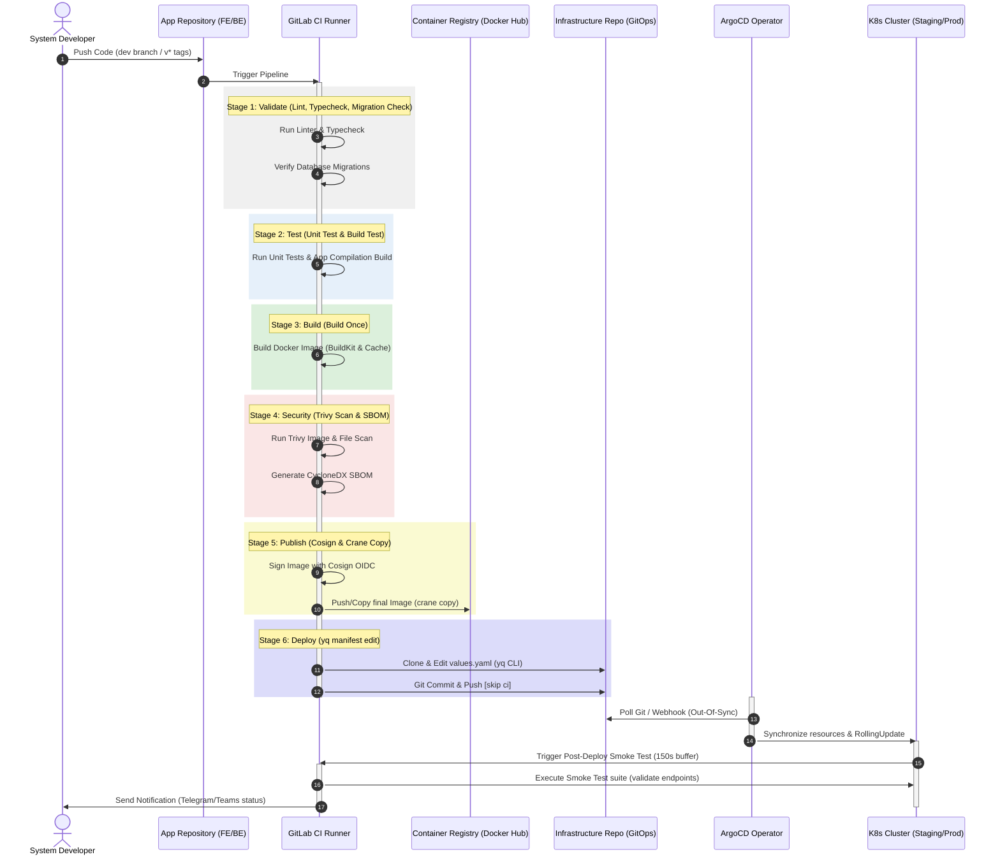

# 🚢 CI/CD Pipeline & GitOps Flow

Tài liệu này mô tả chi tiết quy trình tích hợp liên tục và triển khai liên tục (CI/CD) dựa trên triết lý **GitOps** sử dụng **GitLab CI** và **ArgoCD**.

---

## 🏗️ Kiến Trúc Kho Lưu Trữ (Repository Structure)

Dự án được phân rã thành 3 kho lưu trữ độc lập để đảm bảo an toàn bảo mật thông tin và phân tách trách nhiệm vận hành:

1. **Frontend Repository ([`frontend/`](../../frontend))**: Chứa toàn bộ mã nguồn giao diện Next.js (App Router, Standalone Mode).
2. **Backend Repository ([`backend/`](../../backend))**: Chứa toàn bộ mã nguồn API NestJS (Prisma, NestJS).
3. **Infrastructure Repository ([`infra/`](../../infra))**: Chứa các Ansible Playbooks setup máy chủ, cấu hình Helm Charts và các file định nghĩa biến (values.yaml) cho Staging/Production.

---

## 🔄 Sơ Đồ Quy Trình Triển Khai (Deployment Flow)

Quy trình tự động hóa từ khi nhà phát triển đẩy mã nguồn mới lên Git cho đến khi container phiên bản mới chạy ổn định trên cụm Kubernetes:

---

## 🛠️ Quy Trình Chi Tiết Các Bước (7 Stages of GitOps Pipeline)

### Stage 1: Validate (Xác thực chất lượng & Migration)
*   **install_dependencies**: Thực hiện chuẩn bị và tải các package thông qua `pnpm` (sử dụng cache `.pnpm-store`). Đồng thời chạy `prisma generate` để khởi tạo Prisma Client.
*   **lint**: Kiểm tra cú pháp và tiêu chuẩn code bằng `eslint`.
*   **typecheck**: Biên dịch kiểm tra kiểu tĩnh của TypeScript (`tsc --noEmit`) nhằm tránh các lỗi runtime.
*   **check_migrations**: Khởi tạo cơ sở dữ liệu Postgres test tạm thời trong container, chạy thử `prisma migrate deploy` và so sánh cấu trúc migration file với schema thực tế để đảm bảo không bị lệch database schema.

### Stage 2: Test (Kiểm thử đơn vị & Biên dịch thử)
*   **unit_test**: Thực thi toàn bộ mã nguồn kiểm thử tự động (Jest), tính toán và xuất báo cáo độ bao phủ mã nguồn (code coverage).
*   **build_test**: Thử nghiệm biên dịch toàn bộ source code của ứng dụng. Bước này giúp phát hiện sớm các lỗi import hoặc lỗi cấu hình webpack trước khi đóng gói thành Docker Image.

### Stage 3: Build (Đóng gói một lần - Build Once)
*   **build_image**: Tận dụng công cụ `docker buildx` và cơ chế BuildKit. Lấy (pull) cache cũ về máy ảo runner, biên dịch và đẩy (push) image dạng cache lên Registry. Quá trình này tạo ra `BUILD_IMAGE` tạm thời gắn nhãn tag theo mã Commit SHA (`build-$CI_COMMIT_SHA`).

### Stage 4: Security (Quét lỗ hổng & sinh SBOM)
*   **trivy_scan**: Sử dụng công cụ **Trivy (v0.70.0)** để thực hiện quét toàn bộ lỗ hổng bảo mật bên trong container image vừa được tạo. Ngăn chặn và ngắt pipeline ngay lập tức nếu phát hiện lỗi bảo mật ở mức `HIGH` hoặc `CRITICAL`.
*   **generate_sbom**: Tạo tệp tin Software Bill of Materials (SBOM) định dạng CycloneDX JSON để lưu trữ minh bạch danh sách các thành phần/thư viện của ứng dụng.

### Stage 5: Publish (Ký số & Phát hành - Cosign & Crane)
*   **sign_image**: Sử dụng công cụ **Cosign** (kết hợp xác thực OIDC Keyless) để ký số xác minh tính chính danh của Docker image, ngăn chặn tấn công giả mạo nguồn cung cấp phần mềm (Supply Chain Attack).
*   **publish_staging (Nhánh `dev`)**: Sử dụng công cụ siêu nhẹ **crane** sao chép trực tiếp Docker image tạm sang Docker image môi trường Staging (`dev-$CI_COMMIT_SHORT_SHA`) mà không cần chạy lệnh `docker build` lại.
*   **fetch_image (Thẻ `v*` tags)**: Thực hiện promote Docker image dev đã kiểm định an toàn từ Staging sang Production tag (ví dụ: `v1.2.0`) bằng **crane copy**.

### Stage 6: Deploy (Cập nhật Git Manifests)
*   **deploy_staging (Nhánh `dev`)**: Tự động clone kho cấu hình hạ tầng `portfolio-infratructure`, dùng công cụ `yq` thay đổi nhãn tag của backend/frontend values sang `dev-$CI_COMMIT_SHORT_SHA`, sau đó commit và push trực tiếp với cờ `[skip ci]`.
*   **manual_approval & deploy_production (Thẻ `v*` tags)**: Yêu cầu quản trị viên/trưởng nhóm nhấn nút duyệt thủ công trên GitLab UI. Khi được duyệt, pipeline sẽ tự động cập nhật nhãn tag mới cùng mã định danh SHA (digest) của Docker image Production vào file values tương ứng trên repo `portfolio-infratructure`.

### Stage 7: Post-Deploy (Smoke Test & Thông báo)
*   **smoke_test**: Chờ một khoảng thời gian trễ đồng bộ (150 giây đối với Staging/Production để ArgoCD hoàn tất nạp và rollout) sau đó thực thi các phép kiểm thử HTTP (curl/jq) tự động lên các endpoint quan trọng như healthcheck `/api/v1/health`, public posts, authentication gate.
*   **after_script (Notify)**: Bất kể pipeline thành công hay thất bại, script `notify.sh` sẽ tự động tính toán tổng thời gian chạy và gửi báo cáo chi tiết đến kênh chat của đội ngũ vận hành (Telegram/MS Teams).

---

## ⚡ Các Kỹ Thuật Tối Ưu Hóa Pipeline (Pipeline Optimizations)

Để đảm bảo hiệu năng tối ưu, tốc độ phản hồi nhanh và giảm thiểu hao phí tài nguyên máy chủ Runner, hệ thống CI/CD áp dụng các kỹ thuật:

1. **Bộ Nhớ Đệm PNPM Thông Minh (Local Store Caching):**
   * Loại bỏ hoàn toàn anti-pattern đóng gói thư mục `node_modules` qua artifacts. Thay vào đó, áp dụng cơ chế cache thư mục lưu trữ cục bộ `.pnpm-store`. Mỗi job sẽ chạy `pnpm install --frozen-lockfile --prefer-offline` cực kỳ nhanh chóng và tránh được các lỗi biên dịch chéo hệ điều hành.
2. **Kéo Bộ Nhớ Đệm Docker Trước Khi Build (Docker Cache Pulling):**
   * Chạy lệnh `docker pull $IMAGE_NAME:cache || true` trước khi build để nạp sẵn các layer cache manifest vào daemon, giúp BuildKit đối chiếu và tái sử dụng layer cache tức thì từ registry.
3. **Môi Trường Sạch & Tránh Config Drift:**
   * Không sinh file `.env` giả trong quá trình CI. Mọi biến môi trường cần thiết (ví dụ: `DATABASE_URL` cho Prisma client generator) được nạp trực tiếp qua GitLab CI Variables hoặc định nghĩa tập trung trong YAML.
4. **Quét Lỗ Hổng Bảo Mật Toàn Diện (Dependency & Container Scans):**
   * Bổ sung job `scan_dependencies` chạy Trivy quét file hệ thống (`trivy fs`) trực tiếp trên mã nguồn và file lock để phát hiện lỗ hổng thư viện trước khi đóng gói, song song với việc quét lỗ hổng của Docker Image.
5. **Khóa Xử Lý Song Song (Resource Group Lock):**
   * Định nghĩa `resource_group: production` cho job deploy môi trường Production để ngăn chặn xung đột (race condition) khi có nhiều pipeline deploy cùng lúc.
6. **Gán Nhãn Phiên Bản Ổn Định (Version Pinning):**
   * Khóa cứng toàn bộ nhãn phiên bản của các Docker Image làm nhiệm vụ chạy phụ trợ (như `docker:27.5.1`, `aquasec/trivy:0.62.0`, `alpine:3.21`), đảm bảo pipeline luôn chạy ổn định và không bị lỗi đột ngột khi các base image bên ngoài thay đổi.

---

## 📸 Minh Họa Quy Trình Pipeline Trên GitLab (Pipeline Screenshots)

Dưới đây là một số hình ảnh thực tế của quy trình chạy pipeline trên GitLab CI/CD:

### 1. Pipeline Staging cho Backend
Khi có code mới push vào nhánh `dev`, hệ thống sẽ kích hoạt chạy tự động các step bao gồm: Lint, Test, Security Scan (Trivy), Build và Push Image, kết thúc bằng việc cập nhật manifest tag tự động.

### 2. Dừng Pipeline Ngay Khi Có Step Thất Bại
Cơ chế kiểm soát an toàn sẽ lập tức ngăn chặn việc build/deploy và gửi cảnh báo nếu bất kỳ bước kiểm tra chất lượng hoặc quét bảo mật nào bị lỗi.

### 3. Nút Trigger Thủ Công Phê Duyệt Deploy Production
Đối với nhánh Production, job triển khai thực tế (`deploy_production`) được thiết lập ở trạng thái chờ duyệt thủ công (Manual Approve) để kiểm soát chất lượng an toàn.

---

## 🚀 Hướng Dẫn Kích Hoạt Deploy Production (Manual Trigger)

Quy trình deploy Production được thiết kế an toàn qua 2 lớp bảo vệ để tránh các thao tác sai lầm ngoài ý muốn:

1. **Tạo Git Tag từ nhánh `main`:**
   * Truy cập GitLab > Repository > Tags > **Create Tag**.
   * Đặt tên tag theo chuẩn Semantic Versioning (ví dụ: `v1.2.0`). Việc này sẽ tự kích hoạt job build và đẩy Docker Image lên Docker Hub với nhãn `v1.2.0`.
2. **Kích hoạt Deploy trên GitLab Pipelines:**
   * Truy cập GitLab > CI/CD > Pipelines.
   * Tìm pipeline tương ứng với tag vừa tạo, click vào danh sách Jobs.
   * Tìm job **`deploy_production`** và nhấn nút **Play (Run)**.
   * ArgoCD sẽ nhận diện tag `v1.2.0` này và cập nhật lên cụm K8s Production.
