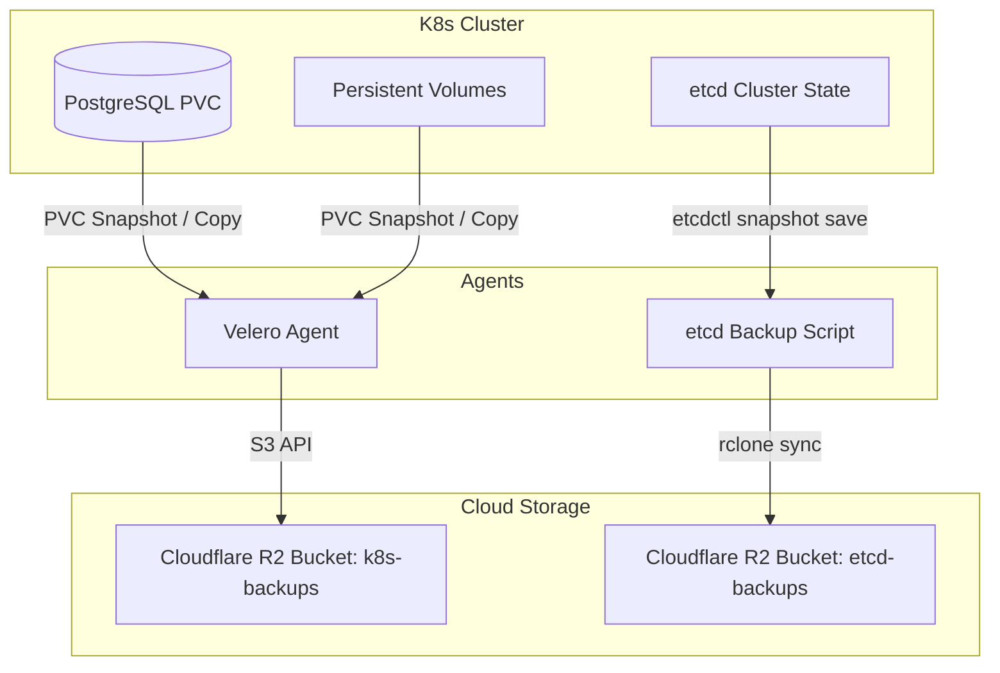
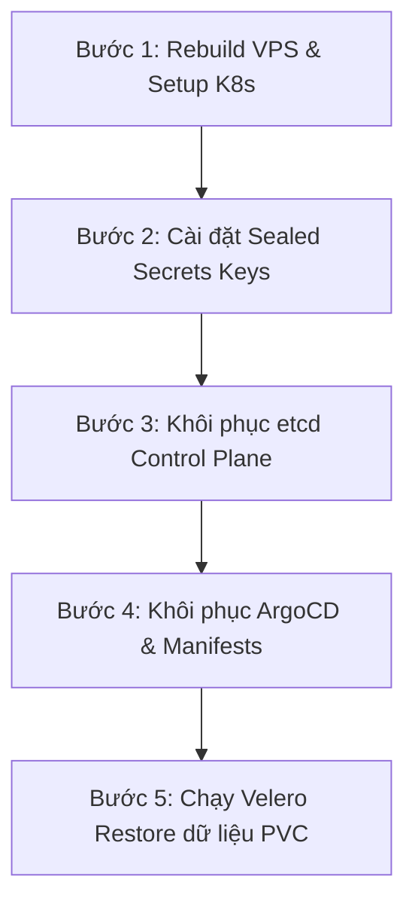

# 💾 Disaster Recovery & Backup Strategy (Velero + etcd to R2)

Tài liệu này đặc tả kiến trúc sao lưu (Backup) và quy trình khôi phục sau thảm họa (Disaster Recovery - DR) của cụm Kubernetes, cơ sở dữ liệu PostgreSQL và trạng thái control plane (etcd).

---

## 1. Kiến Trúc Sao Lưu (Backup Architecture)

Để đảm bảo khả năng phục hồi dữ liệu trong mọi tình huống (VPS cháy, mất dữ liệu SSD, cấu hình cụm hỏng nặng), hệ thống áp dụng cơ chế sao lưu kép tự động đẩy về **Cloudflare R2 Object Storage** (S3-Compatible):



### 1.1. Sao lưu Ứng dụng & PVCs (Velero)
*   **Công cụ**: **Velero v1.14+** kết hợp với plugin AWS (để tương tác với Cloudflare R2 qua chuẩn S3 API).
*   **Lịch trình tự động (Schedules)**: Chạy định kỳ lúc **02:00 AM giờ Việt Nam** (tức 19:00 UTC) hàng ngày.
*   **Thời gian lưu trữ (TTL)**: **7 ngày** (tự động dọn dẹp các bản sao lưu cũ để tối ưu dung lượng).
*   **Lệnh kiểm tra lịch trình**:
    *   *Cách 1 (CLI trên máy Client/Host):*
        ```bash
        velero schedule get
        ```
    *   *Cách 2 (Thông qua Pod Velero trong cụm):*
        ```bash
        kubectl exec -n velero deployment/velero -c velero -- velero schedule get
        ```
    *   *Cách 3 (Truy vấn Custom Resource trực tiếp):*
        ```bash
        kubectl get schedules.velero.io -n velero
        ```

### 1.2. Sao lưu Cấu hình Control Plane (etcd snapshots)
*   **Công cụ**: `etcdctl` (để chụp snapshot cơ sở dữ liệu etcd) kết hợp với `rclone` (để đồng bộ file lên R2).
*   **Lịch trình tự động**: Script hoặc CronJob tự động kích hoạt chụp snapshot etcd hàng ngày.

#### Trường hợp A: etcd chạy trực tiếp trên Host Node (External/Standalone Host)
*   **Script đồng bộ etcd**:
    ```bash
    #!/bin/bash
    # Chụp snapshot etcd lưu cục bộ trên host
    sudo ETCDCTL_API=3 etcdctl --endpoints=https://127.0.0.1:2379 \
      --cacert=/etc/kubernetes/pips/ca.crt \
      --cert=/etc/kubernetes/pips/healthcheck-client.crt \
      --key=/etc/kubernetes/pips/healthcheck-client.key \
      snapshot save /var/lib/etcd-backup/etcd-snapshot.db

    # Đồng bộ snapshot etcd lên Cloudflare R2 bucket
    rclone sync /var/lib/etcd-backup r2:blog-etcd-backups --progress
    ```

#### Trường hợp B: etcd chạy dưới dạng Static Pod trong cụm (Standard Kubeadm setup)
*   **Lệnh chụp snapshot chạy thông qua Pod**:
    ```bash
    # Tìm tên Pod etcd (ví dụ: etcd-k8s-control-plane)
    kubectl get pods -n kube-system -l component=etcd

    # Chạy snapshot save trong Pod (thư mục /var/lib/etcd được mount hostPath về máy vật lý)
    kubectl exec -n kube-system etcd-<master_node_name> -- sh -c \
      "ETCDCTL_API=3 etcdctl --endpoints=https://127.0.0.1:2379 \
      --cacert=/etc/kubernetes/pki/etcd/ca.crt \
      --cert=/etc/kubernetes/pki/etcd/server.crt \
      --key=/etc/kubernetes/pki/etcd/server.key \
      snapshot save /var/lib/etcd/etcd-snapshot.db"
    ```

### 1.3. Cấu trúc lưu trữ trên Cloudflare R2
Các bản sao lưu được lưu trữ có tổ chức dưới các bucket dạng S3:
*   `r2:blog-k8s-backups/backups/`: Thư mục lưu trữ manifest tài nguyên K8s và metadata của Velero.
*   `r2:blog-k8s-backups/restores/`: Nhật ký các lần khôi phục hệ thống.
*   `r2:blog-etcd-backups/etcd-snapshot.db`: File snapshot cơ sở dữ liệu phân tán etcd của Control Plane.

---

## 2. Quy Trình Khôi Phục Sau Thảm Họa (Disaster Recovery Process)

Khi VPS vật lý bị hỏng hóc hoàn toàn hoặc dữ liệu bị phá hủy, quy trình dựng lại hệ thống và khôi phục dữ liệu được thực hiện theo 5 bước tuần tự sau:



### Bước 1: Rebuild VPS & Cài đặt Kubernetes mới
1.  Khởi tạo một VPS trống mới với hệ điều hành Ubuntu/Debian sạch.
2.  Cập nhật địa chỉ IP của VPS mới vào file Ansible Inventory tại `infra/ansible/inventory/hosts.ini`.
3.  Thực thi playbook Ansible để cấu hình hạ tầng K8s (Docker, Containerd, K3s, Firewall, SSH Port 2222):
    ```bash
    ansible-playbook -i ansible/inventory/hosts.ini ansible/playbooks/setup_cluster.yml --ask-become-pass
    ```

### Bước 2: Nạp lại khóa giải mã Sealed Secrets (Sealed Secrets Decryption Keys)
Trước khi khôi phục ứng dụng, bạn bắt buộc phải nạp lại Private key cũ của Sealed Secrets (đã được lưu trữ ngoại tuyến an toàn) để cụm mới có thể giải mã các Secret YAML:
```bash
kubectl apply -f sealed-secrets-private-keys.yaml
# Khởi động lại Sealed Secrets controller để nạp key mới
kubectl rollout restart deployment/sealed-secrets-controller -n kube-system
```

### Bước 3: Khôi phục cơ sở dữ liệu etcd (Nếu cần khôi phục cấu hình cụm cũ)
> [!CAUTION]
> Tác vụ khôi phục etcd có rủi ro cao, chỉ thực hiện khi cần giữ lại chính xác các cài đặt hệ thống cấp thấp của cụm cũ mà không muốn deploy mới hoàn toàn.

1.  **Dừng các thành phần Control Plane**:
    Di chuyển tạm thời các file cấu hình Static Pods ra khỏi thư mục của kubelet để dừng chúng:
    ```bash
    sudo mv /etc/kubernetes/manifests/*.yaml /tmp/
    # Đảm bảo không còn container hệ thống nào chạy
    sudo crictl ps
    ```
2.  **Khôi phục từ snapshot**:
    Tải file `etcd-snapshot.db` từ Cloudflare R2 về VPS và chạy lệnh:
    ```bash
    sudo ETCDCTL_API=3 etcdctl snapshot restore "/path/to/etcd-snapshot.db" \
      --name=k8s-prod \
      --initial-cluster=k8s-prod=https://10.200.0.1:2380 \
      --initial-cluster-token=etcd-cluster-1 \
      --initial-advertise-peer-urls=https://10.200.0.1:2380 \
      --data-dir=/var/lib/etcd
    ```
3.  Đặt lại quyền và khởi động lại Control Plane:
    ```bash
    sudo chown -R root:root /var/lib/etcd
    sudo mv /tmp/*.yaml /etc/kubernetes/manifests/
    ```

### Bước 4: Đồng bộ hóa Ứng dụng qua ArgoCD
1.  Cài đặt ArgoCD lên cụm Kubernetes mới.
2.  Đồng bộ hóa Manifests từ kho lưu trữ `portfolio-infrastructure` về cụm mới để tự động dựng lại các Namespace, Deployments, Services, và Ingresses.

### Bước 5: Khôi phục dữ liệu PV/PVC từ Velero
1.  Đảm bảo Velero Agent trên cụm mới đã được cài đặt và kết nối thành công với R2 Bucket:
    *   *Cách 1 (Sử dụng Velero CLI):*
        ```bash
        velero backup get
        ```
    *   *Cách 2 (Thông qua Pod Velero):*
        ```bash
        kubectl exec -n velero deployment/velero -c velero -- velero backup get
        ```
    *   *Cách 3 (Sử dụng kubectl):*
        ```bash
        kubectl get backups.velero.io -n velero
        ```
2.  Thực hiện khôi phục dữ liệu (Bao gồm dữ liệu PostgreSQL, Backend Uploads) từ bản sao lưu gần nhất:
    *   *Cách 1 (Sử dụng Velero CLI):*
        ```bash
        velero restore create --from-backup manual-backup-xxxx
        ```
    *   *Cách 2 (Thông qua Pod Velero):*
        ```bash
        kubectl exec -n velero deployment/velero -c velero -- velero restore create --from-backup manual-backup-xxxx
        ```
3.  **Theo dõi tiến trình**:
    *   *Cách 1 (Sử dụng Velero CLI):*
        ```bash
        velero restore get
        velero restore describe <restore-name>
        ```
    *   *Cách 2 (Thông qua Pod Velero):*
        ```bash
        kubectl exec -n velero deployment/velero -c velero -- velero restore get
        kubectl exec -n velero deployment/velero -c velero -- velero restore describe <restore-name>
        ```
    *   *Cách 3 (Sử dụng kubectl):*
        ```bash
        kubectl get restores.velero.io -n velero
        ```

> [!TIP]
> **Khôi phục thủ công database PostgreSQL qua pg_dump**:
> Nếu chỉ muốn khôi phục riêng lẻ cơ sở dữ liệu PostgreSQL từ một tệp SQL backup thủ công mà không muốn chạy Velero:
> ```bash
> cat production_backup.sql | kubectl exec -i postgres-0 -n blog-prod -- psql -U <db_user> -d <db_name>
> ```
