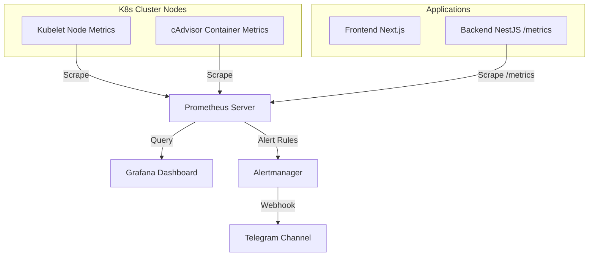

# 📊 Monitoring & Dashboards Guide (Prometheus & Grafana)

Tài liệu này hướng dẫn cách giám sát hiệu năng cụm Kubernetes, đo đạc tài nguyên (CPU, Memory) và theo dõi trạng thái hoạt động của các ứng dụng bằng Prometheus và Grafana.

---

## 1. Kiến trúc giám sát (Monitoring Architecture)

Hệ thống sử dụng bộ công cụ giám sát tiêu chuẩn vàng của Kubernetes:

### Thành phần chính:
*   **Prometheus Server**: Thu thập (pull) các dữ liệu số liệu (metrics) từ các node, container và ứng dụng theo chu kỳ **15 giây**.
*   **Grafana**: Giao diện trực quan hóa dữ liệu qua các biểu đồ (dashboards) sinh động phục vụ theo dõi thời gian thực.
*   **Alertmanager**: Tiếp nhận cảnh báo từ Prometheus và xử lý gửi thông báo đến các kênh chat (Telegram/MS Teams).

---

## 2. Các chỉ số đo đạc cốt lõi (Core Metrics)

Hệ thống theo dõi chặt chẽ các chỉ số sau để đưa ra cảnh báo kịp thời:

### 2.1. Hạ tầng cụm (Infrastructure Metrics)
*   **Node CPU Usage**: Đo mức sử dụng CPU của VPS vật lý. Cảnh báo kích hoạt nếu vượt ngưỡng **90%** liên tiếp trong 5 phút.
*   **Node Memory Usage**: Theo dõi mức tiêu thụ RAM của hệ thống.
*   **Disk Pressure**: Cảnh báo nếu dung lượng ổ đĩa khả dụng của VPS giảm xuống dưới **10%**.

### 2.2. Tài nguyên Container (Pod Resource Metrics)
*   **Pod CPU / Memory Usage**: Đối chiếu lượng tài nguyên tiêu thụ thực tế với định lượng `requests` và `limits` của Kubernetes.
*   **OOMKilled Detection**: Phát hiện và cảnh báo ngay lập tức nếu container bị sập do tràn bộ nhớ (Out-Of-Memory).

### 2.3. Hiệu năng Ứng dụng (Application Metrics)
*   **HTTP Request Rate**: Tần suất truy cập API của người dùng (Request per second - RPS).
*   **Error Rate (HTTP 5xx)**: Tỷ lệ phản hồi lỗi hệ thống. Cảnh báo kích hoạt nếu tỷ lệ lỗi HTTP 5xx vượt quá **5%** tổng lượng request trong 2 phút.
*   **Database Connection Pool**: Số lượng kết nối đang mở từ NestJS Backend đến PostgreSQL Database, ngăn ngừa cạn kiệt connection pool.

---

## 3. Hướng dẫn sử dụng Dashboards trên Grafana

Truy cập địa chỉ [grafana.luumac.io.vn](https://grafana.luumac.io.vn) (Yêu cầu xác thực qua Cloudflare Zero Trust) để xem các biểu đồ:

1.  **Kubernetes / Compute Resources / Cluster**: Tổng quan tài nguyên toàn cụm (CPU, Memory, Network Bandwidth).
2.  **Kubernetes / Compute Resources / Namespace (Workloads)**: Chi tiết tài nguyên của từng namespace (`production`, `portfolio`).
3.  **Application Metrics (NestJS)**: Dashboard tùy chỉnh thu thập thông tin về Node.js runtime, GC execution time, event loop lag, và API response latency.
