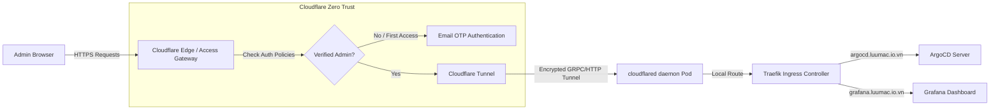

# 🛡️ Cloudflare Zero Trust Access Integration

Tài liệu này mô tả chi tiết giải pháp bảo mật sử dụng **Cloudflare Zero Trust (Cloudflare Access)** để bảo vệ các cổng quản trị nhạy cảm của hệ thống khỏi các cuộc tấn công quét cổng và xâm nhập trái phép từ Internet.

---

## 1. Tổng Quan Kiến Trúc Bảo Mật

Thay vì công khai các cổng dịch vụ quản trị (ArgoCD, Grafana, Kubernetes Dashboard) ra internet công cộng, hệ thống sử dụng mạng lưới bảo mật Zero Trust của Cloudflare để ẩn toàn bộ tài nguyên:

### Lợi ích cốt lõi:
*   **Không mở cổng Ingress Public**: Máy chủ VPS không cần mở các cổng `80` hoặc `443` ra Internet công cộng. Mọi kết nối đi vào (Inbound Traffic) đều đi qua một kết nối Tunnel mã hóa được khởi tạo từ trong cụm (Outbound connection từ Pod `cloudflared` ra ngoài Cloudflare Edge).
*   **Ẩn mình trước kẻ tấn công**: Các cuộc quét IP tự động (scanning bots) chỉ nhận thấy các IP Edge của Cloudflare và không thể dò tìm được IP gốc của VPS (Origin IP hiding).
*   **Xác thực trước khi chạm tới cụm**: Yêu cầu xác thực được kiểm soát và thực thi trực tiếp tại hạ tầng biên của Cloudflare. Nếu chưa xác thực thành công, request của người dùng thậm chí sẽ không thể đi vào đường truyền Tunnel để tới Ingress Controller của cụm Kubernetes.

---

## 2. Quy Trình Xác Thực Email OTP

Đối với quản trị viên, khi truy cập vào bất kỳ tên miền con quản trị nào (ví dụ: `argocd.luumac.io.vn`), luồng xác thực diễn ra như sau:

1.  **Chuyển hướng trang đăng nhập**: Cloudflare Access phát hiện request chưa có session token hợp lệ và chuyển hướng người dùng đến trang đăng nhập Zero Trust riêng biệt của hệ thống.
2.  **Nhập Email**: Người dùng nhập địa chỉ email quản trị đã cấu hình trong chính sách chính thức (ví dụ: `admin@gmail.com`).
3.  **Gửi OTP**: Cloudflare kiểm tra email. Nếu email khớp với whitelist, hệ thống sẽ tự động gửi một mã xác thực dùng một lần (One-Time Password - OTP) gồm 6 chữ số về hòm thư của quản trị viên.
4.  **Xác minh thành công**: Người dùng nhập mã OTP trên trình duyệt. Cloudflare Access kiểm tra, cấp JWT cookie dài hạn, và cho phép truy cập trực tiếp vào trang dashboard đích thông qua Cloudflare Tunnel.

---

## 3. Cấu Hình Chính Sách Bảo Mật (Access Policies)

Chính sách bảo mật được thiết lập tập trung trên Cloudflare Zero Trust Dashboard:

*   **Application Type**: Self-hosted.
*   **Domain Rules**:
    *   `argocd.luumac.io.vn` (Quản trị GitOps).
    *   `grafana.luumac.io.vn` (Giám sát hệ thống).
    *   `k8s.luumac.io.vn` (Kubernetes Dashboard).
*   **Rules & Policies**:
    *   **Action**: Allow.
    *   **Session Duration**: 24 giờ (Hết hạn cookie bắt buộc đăng nhập lại).
    *   **Include Criterion**: Địa chỉ Email cụ thể của Quản trị viên hệ thống.

---

## 4. Nhật Ký Truy Cập & Giám Sát (Access Logs)

Cloudflare Zero Trust cung cấp tính năng Access Logs tập trung ghi chép lại mọi hành động truy cập của quản trị viên:
*   Ghi nhận địa chỉ IP, quốc gia, thời gian đăng nhập.
*   Theo dõi thiết bị sử dụng và phiên bản TLS kết nối.
*   Phát hiện các nỗ lực brute-force hoặc truy cập trái phép từ các dải IP lạ để kịp thời đưa ra các cảnh báo hệ thống.
