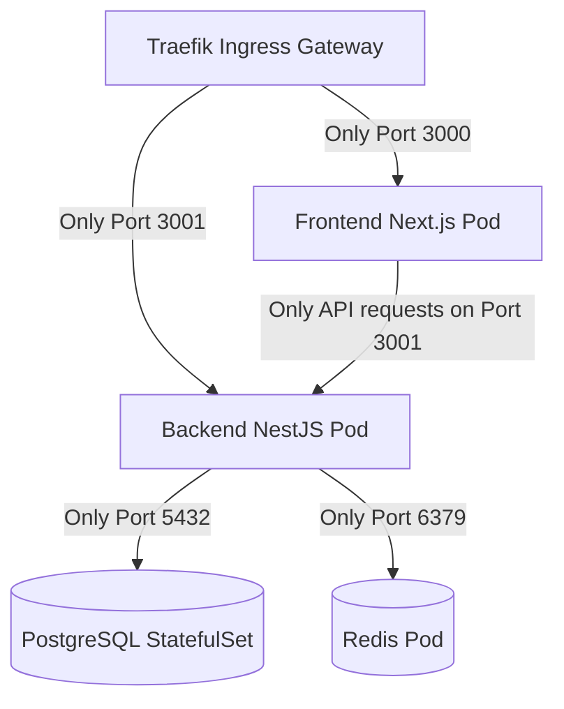

# 🛡️ Kubernetes Network Policies (Namespace Isolation)

Tài liệu này đặc tả cơ chế cô lập mạng lưới (Network Isolation) giữa các Pods và Namespaces trên cụm Kubernetes bằng cách sử dụng **Kubernetes NetworkPolicies**.

---

## 1. Triết lý Thiết kế Bảo mật Mạng (Zero-Trust Network)

Mặc định trong Kubernetes, mọi Pod đều có thể kết nối trực tiếp đến bất kỳ Pod nào khác trong cụm (kể cả khác Namespace). Để tăng cường bảo mật, hệ thống áp dụng triết lý **Zero-Trust Network Policy**:
*   Mọi lưu lượng mạng không được khai báo rõ ràng đều bị **chặn hoàn toàn** (Default Deny ingress and egress).
*   Chỉ mở các kết nối tối thiểu cần thiết để ứng dụng hoạt động (Principle of Least Privilege).

---

## 2. Mô hình Luồng Kết Nối Cho Phép

Sơ đồ dưới đây biểu diễn các kết nối mạng được phép chạy trong cụm:



---

## 3. Các quy tắc NetworkPolicy chi tiết

### 2.1. Bảo vệ Database (PostgreSQL Isolation)
StatefulSet PostgreSQL nằm trong namespace `database-production` chỉ được phép nhận các truy vấn kết nối đi từ Pod Backend trong namespace `production`. Mọi kết nối khác (kể cả từ các Pod debug trong cụm) đều bị từ chối:

```yaml
apiVersion: networking.k8s.io/v1
kind: NetworkPolicy
metadata:
  name: postgres-allow-backend-only
  namespace: database-production
spec:
  podSelector:
    matchLabels:
      app.kubernetes.io/name: postgres-production
  policyTypes:
  - Ingress
  ingress:
  - from:
    - namespaceSelector:
        matchLabels:
          kubernetes.io/metadata.name: production
      podSelector:
        matchLabels:
          app.kubernetes.io/name: portfolio-backend
    ports:
    - protocol: TCP
      port: 5432
```

### 2.2. Bảo vệ Backend API
Pod Backend trong namespace `production` chỉ được phép nhận traffic đi từ:
1.  **Traefik Ingress Controller** (Namespace `infra`) để phục vụ API public cho người dùng.
2.  **Frontend Pod** (Namespace `production`) phục vụ server-side rendering API calls.

---

## 4. Kiểm thử và Xác minh Network Policy

Để xác minh chính sách mạng hoạt động đúng, chúng tôi thực thi các lệnh kiểm thử trực tiếp:
1.  Khởi tạo một Pod kiểm thử tạm thời trong namespace `monitoring`:
    ```bash
    kubectl run network-test --image=alpine -n monitoring --rm -it -- sh
    ```
2.  Thử thực hiện kết nối trực tiếp đến cổng database từ Pod kiểm thử:
    ```bash
    nc -zv postgres-production-0.postgres-production.database-production.svc.cluster.local 5432
    ```
    *Kết quả mong muốn*: Kết nối bị **Blocked / Timeout** (chứng minh NetworkPolicy đã chặn thành công các namespace lạ).
