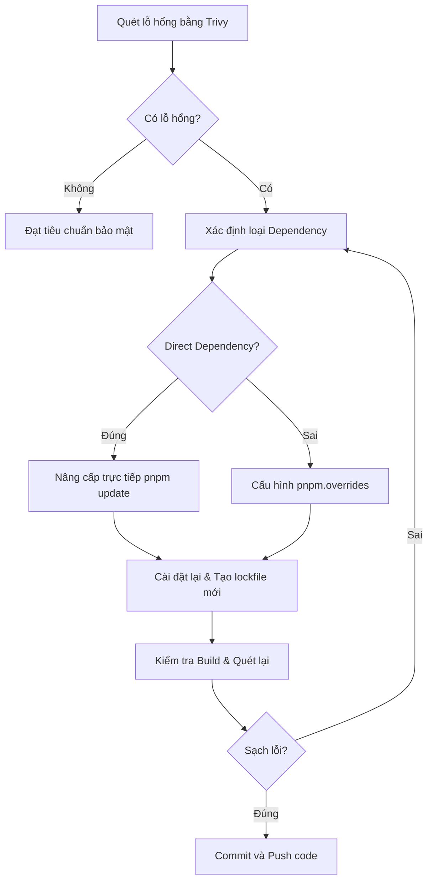

# 🛡️ Security Patching & CVE Mitigation Guide

Tài liệu này hướng dẫn quy trình từng bước để phát hiện, phân tích và vá các lỗ hổng bảo mật trong các thư viện phụ thuộc (dependencies) của dự án bằng công cụ **Trivy** và cơ chế ghi đè của **pnpm**.

---

## 📌 Tổng quan về Quy trình
Khi hệ thống CI/CD chạy pipeline hoặc khi kiểm tra định kỳ bằng Trivy phát hiện các lỗ hổng bảo mật (CVE), chúng ta cần thực hiện quy trình sau để xử lý và đưa hệ thống về trạng thái an toàn (`0 vulnerabilities`).



---

## 🛠️ Quy trình Vá Lỗ Hổng Chi Tiết

### Bước 1: Quét Lỗ Hổng Bảo Mật tại Local
Trước khi đẩy code lên repository, hãy thực hiện quét cục bộ thư mục dự án cần kiểm tra (Ví dụ: `backend` hoặc `frontend`).
```bash
# Chuyển vào thư mục dự án
cd backend

# Chạy Trivy quét hệ thống tệp tin (filesystem)
trivy fs .
```
> [!NOTE]
> Trivy mặc định sẽ phân tích tệp `pnpm-lock.yaml` và các tệp tin trong `node_modules` để lập báo cáo.

---

### Bước 2: Phân Tích Báo Cáo của Trivy
Khi phát hiện lỗ hổng, Trivy sẽ liệt kê chi tiết dưới dạng bảng:
- **Library**: Tên thư viện bị lỗi.
- **Installed Version**: Phiên bản hiện tại đang cài đặt.
- **Fixed Version**: Phiên bản an toàn đã khắc phục lỗi (cần nâng cấp lên phiên bản này hoặc cao hơn).
- **Severity**: Mức độ nghiêm trọng (`MEDIUM`, `HIGH`, `CRITICAL`).

---

### Bước 3: Thực Hiện Nâng Cấp Thư Viện

#### Trường hợp 1: Thư viện là Direct Dependency (Khai báo trực tiếp trong `package.json`)
Nếu thư viện nằm trong mục `dependencies` hoặc `devDependencies` của `package.json`, hãy nâng cấp trực tiếp:
```bash
# Cài đặt phiên bản mới an toàn
pnpm install <library-name>@^<fixed-version>

# Hoặc cập nhật phiên bản cụ thể
pnpm update <library-name>
```

#### Trường hợp 2: Thư viện là Transitive Dependency (Do thư viện khác gọi ngầm)
Nếu thư viện bị lỗi không khai báo trực tiếp mà là phụ thuộc con của thư viện khác, việc chạy `pnpm update` trực tiếp có thể không giải quyết triệt để vì lockfile vẫn giữ nguyên resolution cũ.

👉 **Giải pháp:** Sử dụng tính năng **Ghi đè (Overrides)** của `pnpm` trong `package.json`.

1. Mở `package.json` của dự án bị ảnh hưởng.
2. Thêm hoặc cập nhật block `pnpm.overrides`:
```json
  "pnpm": {
    "overrides": {
      "tên-thư-viện-bị-lỗi": "^<phiên-bản-an-toàn>"
    }
  }
```

> [!TIP]
> **Ví dụ thực tế (Vá lỗi Multer, JS-YAML & Nodemailer trong Backend):**
> ```json
>   "pnpm": {
>     "overrides": {
>       "js-yaml": "^4.2.0",
>       "multer": "^2.2.0",
>       "nodemailer": "^8.0.9"
>     }
>   }
> ```

---

### Bước 4: Áp Dụng và Cập Nhật Lockfile
Sau khi đã cập nhật `package.json` hoặc cấu hình ghi đè, hãy áp dụng các thay đổi:
```bash
# Chạy cài đặt để cập nhật lại pnpm-lock.yaml
pnpm install
```
> [!IMPORTANT]
> Lệnh này sẽ tự động xóa các package phiên bản cũ ra khỏi cây phụ thuộc của lockfile và cài đặt phiên bản an toàn vào `node_modules`.

---

### Bước 5: Kiểm Tra và Xác Nhận
Đảm bảo dự án vẫn hoạt động bình thường và lỗ hổng đã được khắc phục hoàn toàn.

1. **Biên dịch thử dự án (Build Test):**
```bash
pnpm build
```
2. **Quét lại bằng Trivy để xác nhận 0 lỗi:**
```bash
trivy fs .
```
Báo cáo trả về phải hiển thị:
```text
Report Summary
┌────────────────┬──────┬─────────────────┬─────────┐
│     Target     │ Type │ Vulnerabilities │ Secrets │
├────────────────┼──────┼─────────────────┼─────────┤
│ pnpm-lock.yaml │ pnpm │        0        │    -    │
└────────────────┴──────┴─────────────────┴─────────┘
```

---

## Bước 6: Commit và Đẩy Lên Repository
Tách biệt việc vá lỗi bảo mật thành một commit riêng biệt để dễ theo dõi và rollback khi cần thiết:
```bash
git add package.json pnpm-lock.yaml
git commit -m "fix(security): resolve <tên-thư-viện> vulnerabilities via pnpm overrides"
```
