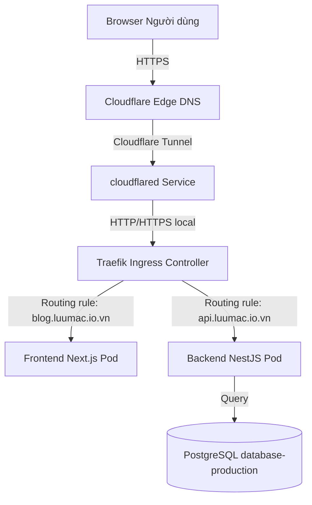
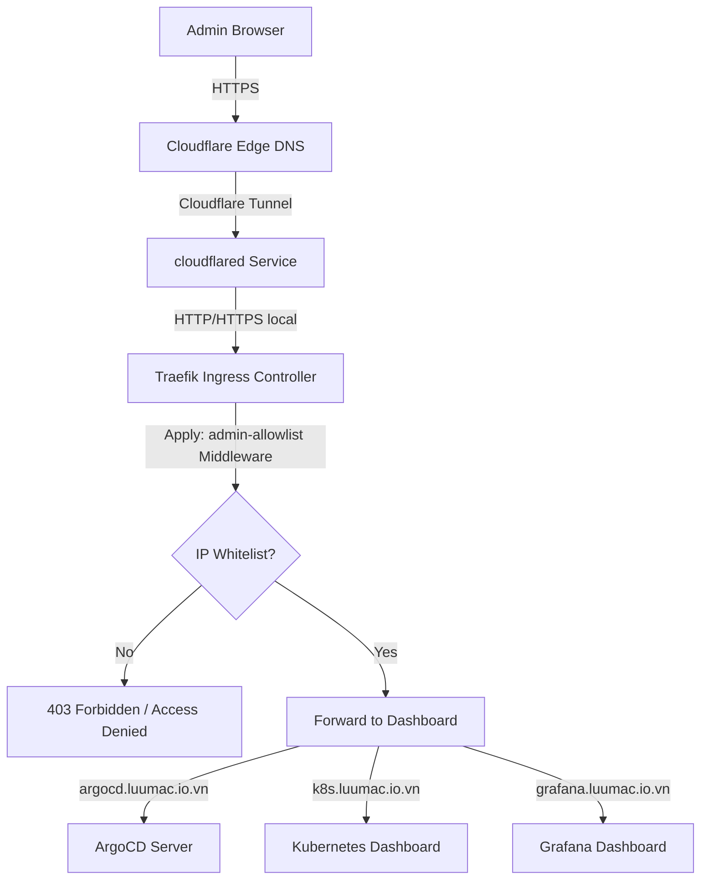

# 🏛️ System Architecture

Tài liệu này mô tả kiến trúc tổng quan hệ thống Portfolio & Blog, từ cách phân chia tài nguyên, luồng dữ liệu của người dùng, luồng truy cập của quản trị viên đến cách phân bổ lưu trữ trên cụm Kubernetes.

---

## 🗺️ Luồng Dữ Liệu & Định Tuyến (Traffic Flow)

Hệ thống sử dụng **Cloudflare Tunnel** làm cổng vào chính (Ingress Tunnel), loại bỏ việc mở cổng trực tiếp từ Router/Firewall của máy chủ ra Internet (ngoại trừ cổng SSH `2222`).

### 1. Luồng truy cập của Người dùng (Public Traffic)
Người dùng truy cập vào Blog hoặc API sẽ đi qua Cloudflare Edge Network, qua Tunnel và đến Traefik Ingress Controller trước khi vào Pod:



### 2. Luồng truy cập của Quản trị viên (Admin Traffic)
Các trang quản trị (ArgoCD, K8s Dashboard, Grafana) được bảo vệ bởi middleware `admin-allowlist` (chỉ chấp nhận các IP được khai báo trước):



---

## 🗂️ Phân Bổ Namespace trên Kubernetes (Cluster Layout)

Cụm Kubernetes được tổ chức thành các Namespace chuyên biệt nhằm cô lập tài nguyên:

| Namespace | Vai trò | Các tài nguyên chính |
| :--- | :--- | :--- |
| **`infra`** | Hạ tầng mạng, định tuyến | Traefik, Cert-Manager, `admin-allowlist` Middleware |
| **`production`** | Môi trường Product | Backend, Frontend (Next.js), PVC Uploads |
| **`portfolio`** | Môi trường Staging | Backend-staging, Frontend-staging, PVC |
| **`database-production`** | Cơ sở dữ liệu Prod | StatefulSet PostgreSQL |
| **`database`** | Cơ sở dữ liệu Staging | StatefulSet PostgreSQL Staging |
| **`monitoring`** | Giám sát & Đo đạc | Prometheus, Grafana, Metrics-Server |
| **`kubernetes-dashboard`**| Giao diện quản trị K8s | Kubernetes Dashboard, `admin-user` ServiceAccount |
| **`argocd`** | Triển khai GitOps | ArgoCD Server, Application Controllers |

---

## 💾 Kiến Trúc Lưu Trữ (Storage Architecture)

Hệ thống lưu trữ trên cụm đơn node được cấu hình sử dụng Local Path Provisioner để ghi trực tiếp lên đĩa cứng vật lý của VPS:

```mermaid
graph LR
    Pods[Frontend/Backend Pods] -->|PVC Mount| PV[Persistent Volume]
    PV -->|Local Directory Mapping| HostDisk[/data/k8s/storage/... trên VPS Host]
```

*   **Đường dẫn lưu trữ Backend Prod:** `/data/k8s/storage/backend-uploads-prod` (Lưu trữ ảnh bìa bài viết, file đính kèm, avatar).
*   **Đường dẫn Database Prod:** `/data/k8s/storage/postgres-production-pvc` (Lưu trữ data PostgreSQL).

---

## ⚙️ Cơ Chế Tự Động Co Giãn (Autoscaling - HPA)

Trên môi trường **Production**, cả Frontend và Backend đều được liên kết với một Horizontal Pod Autoscaler (HPA) theo dõi mức sử dụng tài nguyên:
*   **Tải bình thường:** Hệ thống duy trì tối thiểu **2 Pods** trên mỗi dịch vụ để đảm bảo khả năng High Availability (HA) và Zero-Downtime khi cập nhật.
*   **Tải cao:** Nếu mức sử dụng CPU trung bình vượt ngưỡng **80%**, HPA sẽ tự động kích hoạt tạo thêm Pods lên tối đa **5 Pods**.
