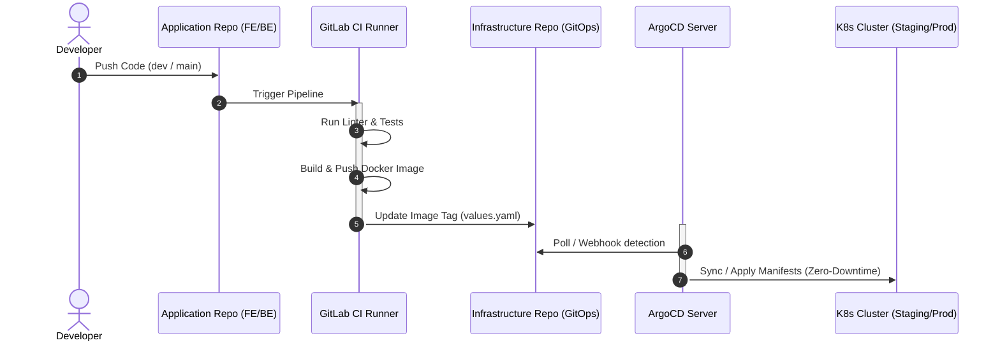

# 🚢 Deployment Flow (Quy Trình Triển Khai GitOps)

Tài liệu này mô tả chi tiết quy trình triển khai tự động (Continuous Integration & Continuous Deployment - CI/CD) dựa trên triết lý **GitOps** sử dụng **GitLab CI** và **ArgoCD**.

---

## 🏗️ Mô Hình Kho Lưu Trữ (Repository Structure)

Dự án được tách biệt thành 3 kho lưu trữ khác nhau để đảm bảo bảo mật và dễ quản lý:

1.  **`portfolio-frontend`**: Chứa toàn bộ mã nguồn giao diện Next.js.
2.  **`portfolio-backend`**: Chứa toàn bộ mã nguồn API NestJS.
3.  **`portfolio-infrastructure`** (Thư mục `infra` hiện tại): Chứa các Ansible Playbooks để dựng cụm, cấu hình Helm Charts và các file định nghĩa biến cho Staging/Production.

---

## 🔄 Sơ Đồ Quy Trình Triển Khai (CI/CD Pipeline)

---

## 🛠️ Quy Trình Chi Tiết Các Bước

### 1. Phân Tích & Đóng Gói (CI - GitLab)
Khi code được push lên GitLab, GitLab Runner sẽ tự động chạy các tác vụ sau:
*   **Kiểm tra cú pháp (Lint):** Đảm bảo code đạt tiêu chuẩn chất lượng.
*   **Build Image:** Sử dụng Dockerfile của dự án để đóng gói thành Docker Image.
    *   *Môi trường Staging (Nhánh `dev`):* Image được tag dạng `dev-<Short-SHA>` và tự động deploy.
    *   *Môi trường Production (Nhánh `main` + Git Tag):* Image được tag chính xác theo version tag (ví dụ: `v1.0.12`).
*   **Đẩy Image:** Docker Image được đẩy lên Docker Hub (`luudinhmac/portfolio-frontend` và `luudinhmac/portfolio-backend`).

### 2. Cập Nhật Phiên Bản GitOps (Update Manifests)
Ở bước cuối của pipeline CI, GitLab Runner sẽ dùng công cụ xử lý YAML cấu trúc **`yq`** để thay đổi chính xác giá trị `.image.tag` trong file cấu hình trên repo `portfolio-infrastructure`:
*   **Staging:** Cập nhật tag mới nhất vào `environments/staging/[app-name]-values.yaml`.
*   **Production:** Cập nhật tag mới nhất (kèm digest SHA) vào `environments/production/[app-name]-values.yaml` (Yêu cầu click chạy thủ công job `deploy_production` trên giao diện GitLab).

### 3. Đồng Bộ Hóa & Kéo Tải (CD - ArgoCD)
ArgoCD được cài đặt trên cụm K8s liên tục lắng nghe các thay đổi trên repo `portfolio-infrastructure`:
*   **Phát hiện sai lệch (Out of Sync):** Khi có commit cập nhật tag mới của GitLab, ArgoCD sẽ phát hiện trạng thái thực tế trên cụm khác với Git.
*   **Tự động đồng bộ (Auto Sync):** ArgoCD tiến hành deploy lại cụm.
    *   Sử dụng chiến lược **RollingUpdate** (được cấu hình trong deployment templates) để tạo Pod mới chạy phiên bản mới trước, kiểm tra Health Check thành công rồi mới tắt Pod cũ.
    *   **Không gây gián đoạn dịch vụ (Zero-Downtime)** cho người dùng.

---

## ⚡ Các Kỹ Thuật Tối Ưu Hóa Pipeline (Senior-Grade Pipeline Optimizations)

Để đảm bảo hiệu năng tối ưu, tốc độ phản hồi nhanh và giảm thiểu hao phí tài nguyên máy chủ Runner, hệ thống CI/CD đã được cấu hình với các kỹ thuật tối ưu hóa chuyên sâu:

1. **Bộ Nhớ Đệm PNPM Thông Minh (Local Store Caching & No Artifact node_modules):**
   * Loại bỏ hoàn toàn anti-pattern đóng gói `node_modules` qua artifacts. Thay vào đó, áp dụng cơ chế cache thư mục lưu trữ cục bộ `.pnpm-store`. Mỗi job sẽ chạy `pnpm install --frozen-lockfile --prefer-offline` cực kỳ nhanh chóng và tránh được các lỗi biên dịch chéo hệ điều hành (architecture mismatch) hoặc lỗi symlink.
2. **Kéo Bộ Nhớ Đệm Docker Trước Khi Build (Docker Cache Pulling):**
   * Chạy lệnh `docker pull $IMAGE_NAME:cache || true` trước khi build để nạp sẵn các layer cache manifest vào daemon, giúp BuildKit đối chiếu và tái sử dụng layer cache tức thì từ registry.
3. **Môi Trường Sạch & Tránh Config Drift:**
   * Không sinh file `.env` giả trong quá trình CI. Mọi biến môi trường cần thiết (ví dụ: `DATABASE_URL` cho Prisma client generator) được nạp trực tiếp qua GitLab CI Variables hoặc định nghĩa tập trung trong YAML, đảm bảo an toàn bảo mật.
4. **Quét Lỗ Hổng Bảo Mật Toàn Diện (Dependency & Container Scans):**
   * Bổ sung job `scan_dependencies` chạy Trivy quét file hệ thống (`trivy fs`) trực tiếp trên mã nguồn và file lock để phát hiện lỗ hổng thư viện trước khi đóng gói, song song với việc quét lỗ hổng của Docker Image.
5. **Khóa Xử Lý Song Song (Resource Group Lock):**
   * Định nghĩa `resource_group: production` cho job deploy môi trường Production để ngăn chặn xung đột (race condition) khi có nhiều pipeline deploy cùng lúc.
6. **Gán Nhãn Phiên Bản Ổn Định (Version Pinning):**
   * Loại bỏ toàn bộ nhãn `:latest` không an toàn của các Docker Image làm nhiệm vụ chạy phụ trợ (như `docker:27.5.1`, `aquasec/trivy:0.62.0`, `alpine:3.21`), đảm bảo pipeline luôn ổn định trong tương lai.

---

## 🚀 Cách Kích Hoạt Deploy Bằng Tay (Production Manual Trigger)

Để tránh lỗi vô tình làm ảnh hưởng tới môi trường Production, quy trình deploy Prod được thiết kế an toàn qua 2 lớp bảo vệ:

1.  **Tạo Git Tag từ nhánh `main`:**
    *   Truy cập GitLab > Repository > Tags > **Create Tag**.
    *   Đặt tên tag theo chuẩn Semantic Versioning (ví dụ: `v1.2.0`). Việc này sẽ tự kích hoạt job build và đẩy Docker Image lên Docker Hub với nhãn `v1.2.0`.
2.  **Kích hoạt Deploy trên GitLab Pipelines:**
    *   Truy cập GitLab > CI/CD > Pipelines.
    *   Tìm pipeline tương ứng với tag vừa tạo, click vào danh sách Jobs.
    *   Tìm job **`deploy_production`** và nhấn nút **Play (Run)**.
    *   ArgoCD sẽ nhận diện tag `v1.2.0` này và cập nhật lên cụm K8s Production.
